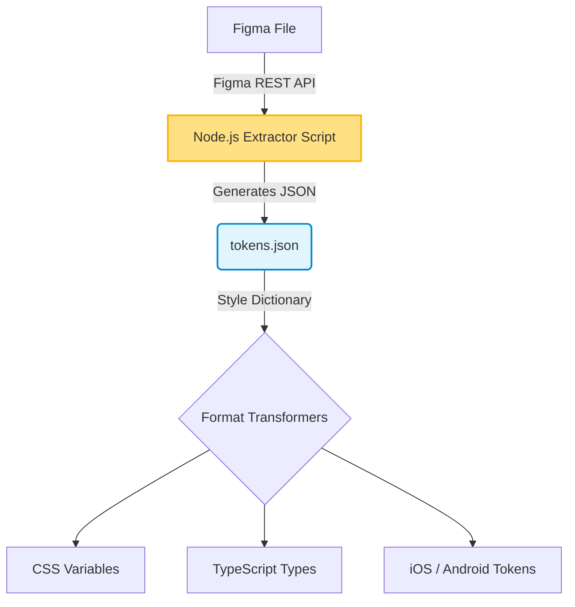

# Figma Integration

Интеграция Figma в процесс разработки — это связующее звено, которое позволяет синхронизировать мир дизайна и мир кода. Это не просто "скачивание SVG-иконок руками", а построение пайплайнов, использующих Figma API или плагины для извлечения дизайн-токенов, ресурсов и даже логики компоновки напрямую в репозиторий проекта.

## Какую боль мы решаем?
Проблема рассинхронизации. Дизайнер меняет оттенок `primary` цвета или добавляет новую иконку. Чтобы это попало в продакшен, фронтендеру нужно зайти в Figma, заметить изменения (или прочитать о них в таске), скопировать значения, перенести в код, собрать PR. Это медленно, подвержено человеческим ошибкам и скучно. Интеграция с Figma автоматизирует рутину: разработчики перестают быть "переводчиками с языка дизайна на язык CSS".

## Как это работает на практике
Чаще всего используется скрипт (например, на Node.js), который стучится в Figma REST API по токену доступа. Он парсит специфичный файл или страницу, где дизайнеры хранят токены (через Figma Variables или плагины вроде Token Studio). Затем эти данные преобразуются в JSON, который прогоняется через Style Dictionary для генерации нужных форматов (CSS, TS, SCSS).



## Антипаттерн vs Правильное решение

❌ **Антипаттерн: Ручной экспорт ассетов**
Разработчик каждый раз выделяет иконку в Figma, нажимает "Export to SVG", скачивает в загрузки, переименовывает, кладет в папку `src/icons` и руками правит атрибуты `fill`.

✅ **Правильное решение: Автоматический пайплайн через Figma API**
Запуск одной команды в терминале, которая делает все сама:
```bash
# Скрипт тянет все иконки со страницы "Icons" в Figma,
# оптимизирует их через SVGO и генерирует React-компоненты.
npm run figma:sync-icons
```

## Скрытые трейдоффы и границы применимости
- **Жесткая структура Figma-файла:** Чтобы скрипт мог распарсить Figma, дизайнеры обязаны поддерживать идеальный порядок. Имена слоев, структура фреймов и страниц должны быть строго стандартизированы. Если дизайнер случайно переименует фрейм с "Icons/Solid" на "Solid Icons", сборка сломается.
- **Лимиты API:** Figma API имеет ограничения по частоте запросов (rate limits). Для очень больших файлов получение данных может занимать продолжительное время, а большие изображения могут не выгрузиться из-за таймаутов.
- **Token Studio vs Figma Variables:** Долгое время для токенов использовался плагин Token Studio (Figma Tokens), так как нативной поддержки не было. С появлением нативных Variables в Figma происходит миграция, но API нативных переменных все еще имеет ряд ограничений (например, типизация типографики), что заставляет команды поддерживать гибридные решения.
