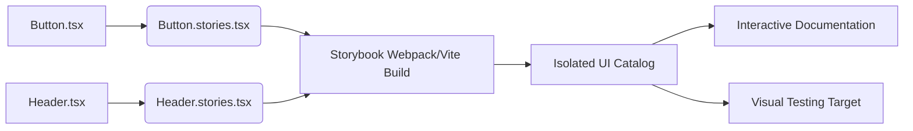

# Storybook

Storybook — это индустриальный стандарт для разработки UI-компонентов в изоляции. Это приложение, которое работает независимо от основного продукта и служит каталогом, песочницей и интерактивной документацией для всех кубиков вашей дизайн-системы.

## Какую боль мы решаем?
Разработка компонентов внутри сложного приложения — это боль. Чтобы сверстать попап "Успешная оплата", разработчику нужно запустить тяжелый бэкенд, пройти флоу авторизации, наполнить корзину товарами, "оплатить" и только тогда увидеть попап. Storybook позволяет рендерить попап отдельно, передавая ему моковые данные через пропсы (Args). Это ускоряет разработку, упрощает ревью и позволяет тестировать краевые состояния (например, слишком длинный текст), которые сложно воспроизвести в реальном приложении.

## Как это работает на практике
Для каждого компонента создается файл с расширением `.stories.tsx`. В нем экспортируются "истории" — различные визуальные и логические состояния компонента. Storybook собирает все эти файлы и генерирует веб-интерфейс с сайдбаром для навигации и панелью управления пропсами (Controls).



## Антипаттерн vs Правильное решение

❌ **Антипаттерн: Привязка к глобальному контексту (Store, Router)**
```tsx
// Плохо: Компонент ломается в Storybook, потому что ожидает Redux Provider
export const DefaultStory = () => <UserProfile id={1} />; // Внутри делает useDispatch()
```

✅ **Правильное решение: "Глупые" презентационные компоненты**
```tsx
// Хорошо: Компонент получает все данные через пропсы, его легко отрендерить
export const DefaultStory = () => (
  <UserProfile user={{ name: "Ivan", role: "admin" }} onLogout={mockFn} />
);
```

## Скрытые трейдоффы и границы применимости
- **Тяжеловесность сборки:** По мере роста дизайн-системы запуск и билд Storybook может стать мучительно долгим (особенно на Webpack). Переход на Vite решает часть проблем, но требует настройки.
- **Поддержка актуальности:** Истории имеют свойство "протухать". Если разработчик обновил API компонента, но забыл обновить `stories.tsx`, Storybook сломается. Это решается линтерами и запуском билда Storybook в CI.
- **Оверхед для мелких проектов:** Если вы пишите MVP на 5 экранов, внедрение и поддержка Storybook заберет больше времени, чем принесет пользы.
