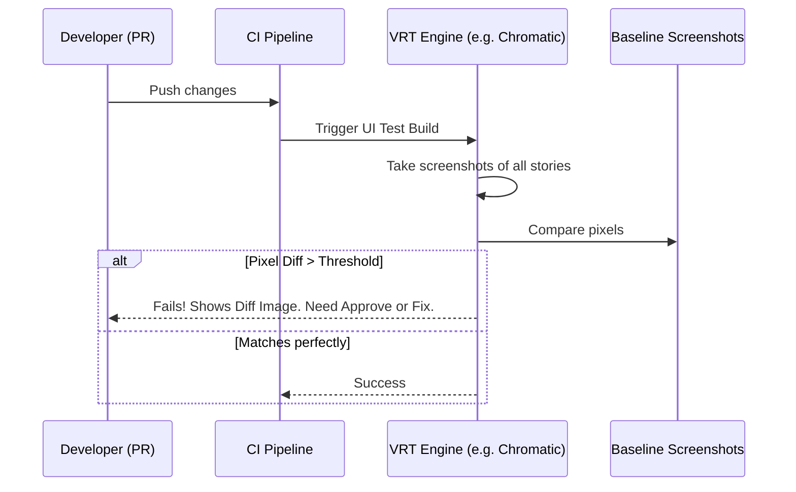

# Visual Regression Testing

Визуальное регрессионное тестирование (VRT) — это автоматизированный процесс поиска "съехавшей верстки". Суть проста: система делает скриншот компонента и попиксельно сравнивает его с эталонным (base) скриншотом. Если есть отличия (разница в пикселях превышает порог) — тест падает. Популярные инструменты: Chromatic, Playwright, Loki, Cypress.

## Какую боль мы решаем?
Unit-тесты (Jest, Testing Library) отлично проверяют логику, но они слепы к визуалу. Они не скажут вам, что после обновления `z-index` у модалки, кнопка "Купить" перекрылась другим элементом. Ручное QA-тестирование дизайн-системы не масштабируется: проверять 50 компонентов в 10 состояниях на 3 браузерах при каждом PR невозможно. VRT гарантирует, что ваши изменения в CSS или разметке не сломали внешний вид на уровне пикселей.

## Как это работает на практике
Обычно VRT интегрируется с каталогом компонентов (например, Storybook). В CI/CD пайплайне поднимается headless-браузер, который обходит все доступные истории. Делаются новые скриншоты, накладываются на "золотые" (утвержденные ранее). Дифф (разница) подсвечивается красным цветом и отправляется разработчику на аппрув.



## Антипаттерн vs Правильное решение

❌ **Антипаттерн: Тестирование динамических данных**
```tsx
// Плохо: Скриншот будет падать каждый день, потому что дата меняется, и пиксели не совпадают.
export const Story = () => <Clock time={new Date()} />;
```

✅ **Правильное решение: Заморозка состояния (Mocking)**
```tsx
// Хорошо: Компонент рендерится с фиксированными данными.
export const Story = () => <Clock time={new Date("2026-01-01T12:00:00Z")} />;
```

## Скрытые трейдоффы и границы применимости
- **Flaky тесты (Ложные срабатывания):** Главный бич VRT — сглаживание шрифтов (anti-aliasing) и рендеринг теней, которые могут отличаться на 1 пиксель от запуска к запуску (особенно на разных ОС: локально у вас Mac, а в CI — Linux). Решается размытием диффа или платформозависимыми скриншотами (или использованием облаков типа Chromatic).
- **Анимации:** Мерцающие курсоры, спиннеры и CSS-транзиции сломают VRT. Для тестов все анимации должны быть отключены или заморожены (часто делается глобальным CSS `* { transition: none !important; }` в тестовом окружении).
- **Цена хранения:** Скриншоты весят много. Хранить историю скриншотов в Git-репозитории (git-lfs) — плохая идея (репозиторий распухнет). Лучше использовать специализированные SaaS.
