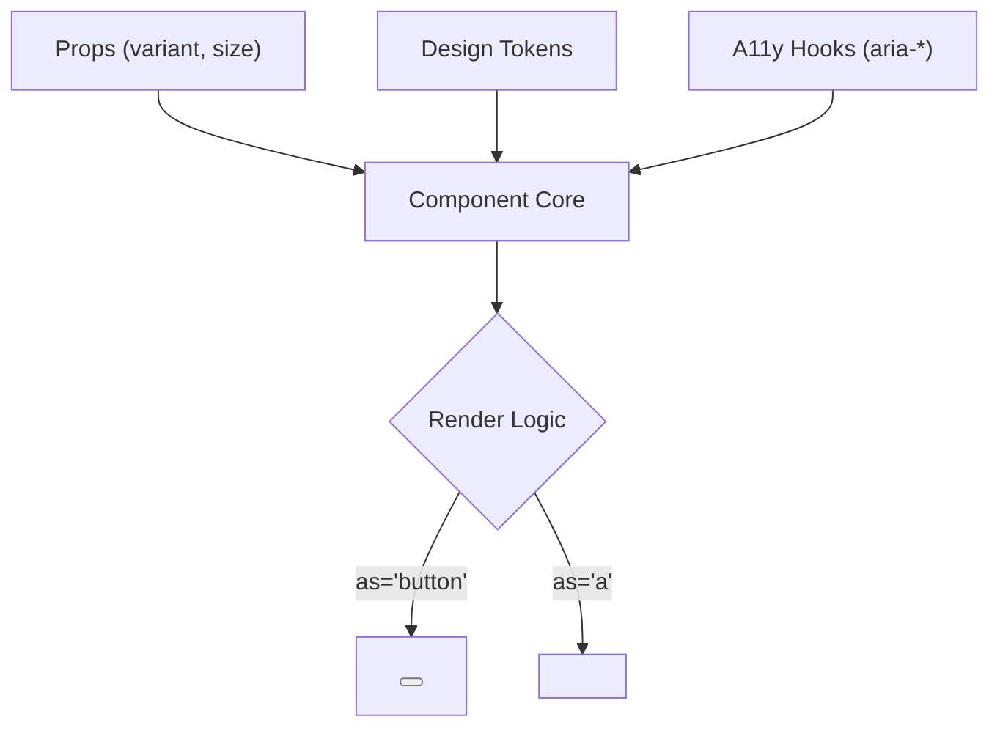

# Components (Система компонентов)

Система компонентов — это ядро любой дизайн-системы (её слой реализации). Это набор изолированных, переиспользуемых UI-блоков, из которых, как из конструктора Lego, собирается интерфейс приложения. Они инкапсулируют в себе стили, логику поведения (например, фокус-менеджмент) и обеспечение доступности (a11y).

## Какую боль мы решаем?
Дублирование кода и рассинхронизация UX. В каждом проекте нужна кнопка, инпут, модалка. Если каждый разработчик пишет их с нуля, мы получаем зоопарк реализаций. В одной модалке по Escape закрывается окно, в другой — нет. В одном инпуте ошибка выводится снизу, в другом — тултипом сбоку. Единая система компонентов гарантирует: один раз спроектировали, один раз написали, тысячу раз переиспользовали с одинаково хорошим UX.

## Как это работает на практике
Компоненты делятся на уровни абстракции:
1. **Primitives (Примитивы):** Крошечные блоки (иконка, текстовый узел).
2. **Components (Базовые):** Кнопки, инпуты, бейджи.
3. **Composites (Составные):** Аккордеоны, селекты, таблицы (собираются из базовых).
Они разрабатываются с использованием полиморфизма (проп `as` или `component`), чтобы компонент `Button` можно было отрендерить как `<a>` ссылку для SEO-роутинга, не дублируя стили.



## Антипаттерн vs Правильное решение

❌ **Антипаттерн: Раздувание API (Божественный компонент)**
```tsx
// Плохо: Компонент пытается угодить всем юзкейсам через миллион флагов. Его невозможно поддерживать.
<Button 
  isDanger 
  withIconRight 
  isSubmit 
  hasLoadingOverlay 
  customMargin="10px"
  overrideColor="#ff0000"
>
  Click
</Button>
```

✅ **Правильное решение: Композиция и семантичные пропсы**
```tsx
// Хорошо: Ограниченный набор вариантов, иконки передаются как чилдрены (композиция).
<Button variant="danger" size="large" type="submit" isLoading>
  Click <Icon name="arrow-right" />
</Button>
```

## Неочевидные нюансы и границы применимости
- **Контролируемые vs Неконтролируемые:** Правильный UI-компонент должен уметь работать в обоих режимах. Если вы передали `value` и `onChange` — он контролируемый. Если передали `defaultValue` — он хранит стейт внутри себя. Это усложняет внутреннюю логику (нужен хук типа `useControllableState`).
- **Стилизация извне (Escape Hatches):** Полностью закрытые компоненты вызывают ненависть продуктовых разработчиков. Обязательно нужен механизм передачи `className` (и объединения их через утилиты вроде `clsx`/`tailwind-merge`), чтобы дать возможность точечно изменить отступ (margin).
- **Доступность (Accessibility):** Написание доступного селекта с клавиатурной навигацией и поддержкой скринридеров занимает недели. Разумный выбор — не писать логику с нуля, а использовать Headless UI библиотеки (Radix UI, React Aria), натягивая поверх них свои дизайн-токены.
