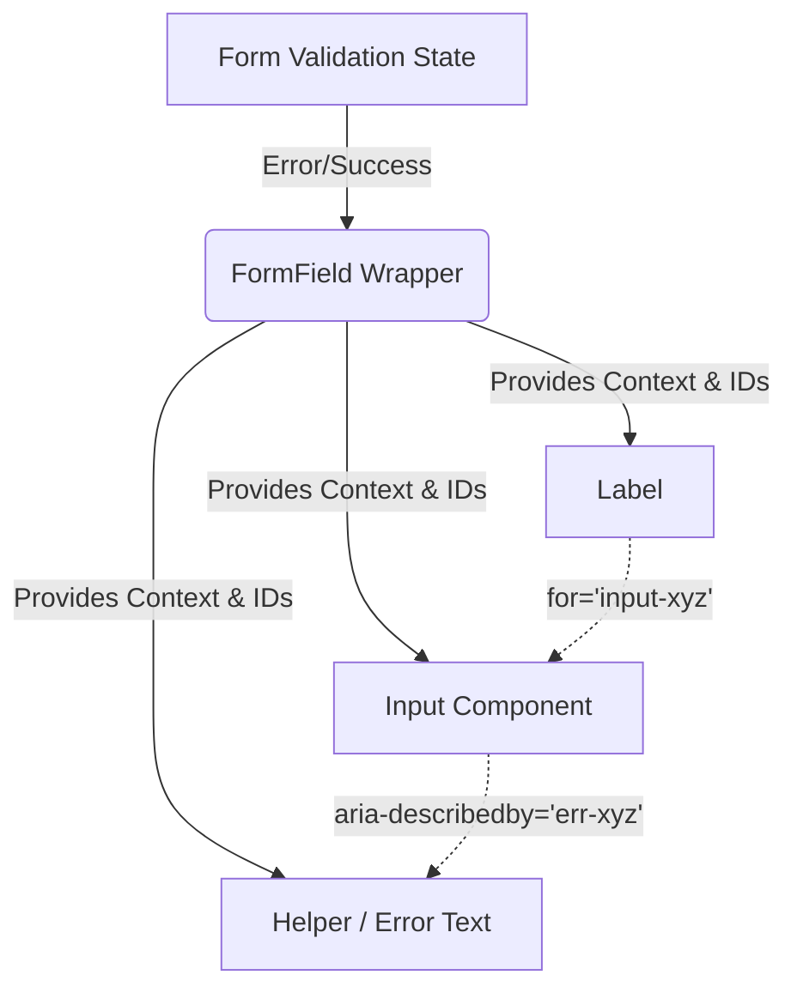

# Form System

Система форм — это комплексное архитектурное решение внутри дизайн-системы, которое стандартизирует работу с пользовательским вводом. Она объединяет элементы управления (инпуты, чекбоксы, селекты), лейблы, подсказки (хинты) и сообщения об ошибках в единый, консистентный механизм.

## Какую боль мы решаем?
Работа с формами во фронтенде всегда болезненна. Как правильно связать `<label>` с `<input>` по ID (учитывая, что на странице может быть несколько одинаковых форм)? Где рендерить текст ошибки валидации: под полем, сбоку, в тултипе? Как прокинуть состояние "ошибка" (красная рамка) из внешней библиотеки валидации внутрь глупого компонента инпута? Form System дает готовые паттерны, чтобы продуктовые разработчики просто описывали поля, не думая об обвязке.

## Как это работает на практике
Обычно создается компонент-обертка `FormField` или `Form.Item`, который берет на себя композицию. Он генерирует уникальные ID для доступности (a11y), связывает `aria-describedby` инпута с ID текста ошибки, управляет отступами между элементами.



## Антипаттерн vs Правильное решение

❌ **Антипаттерн: Ручная сборка формы каждый раз**
```tsx
// Плохо: Разработчик руками управляет ID, отступами и условным рендером ошибок. Много дублирования.
<div>
  <label htmlFor="email-1">Email</label>
  <input id="email-1" type="email" className={errors.email ? 'border-red' : ''} />
  {errors.email && <span className="text-red">{errors.email.message}</span>}
</div>
```

✅ **Правильное решение: Композиция через Form System Context**
```tsx
// Хорошо: Вся обвязка скрыта под капотом, ID генерируются автоматически, стили синхронизированы.
<FormField name="email" label="Email" error={errors.email?.message}>
  <Input type="email" placeholder="Enter email" />
</FormField>
```

## Скрытые трейдоффы и границы применимости
- **Интеграция с библиотеками форм:** Дизайн-система должна оставаться агностичной к библиотекам (работать и с Formik, и с React Hook Form, и с нативными формами). Это означает, что Form System должна ожидать пропсы (value, onChange, onBlur, error), а не завязываться на контекст конкретной библиотеки.
- **Вложенность и кастомные раскладки:** Строгая структура `FormField` ломается, когда дизайн требует разместить инпут и кнопку submit в одну строку (inline form). Форм-система должна быть достаточно гибкой, позволяя разобрать обертку на части (`FormLabel`, `FormControl`, `FormMessage`) для кастомной верстки.
- **Оверхед на DOM-узлы:** Каждое поле превращается в дерево из 4-5 оберток. Для очень больших форм (например, табличный ввод на 500 ячеек) это может ударить по производительности рендеринга.
