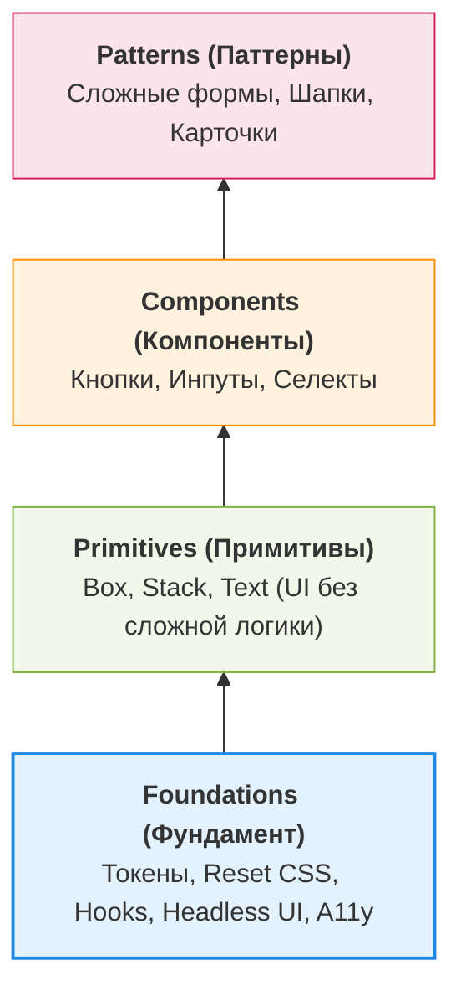

# Foundations (Основы системы компонентов)

В компонентной архитектуре дизайн-системы Foundations (Основы) — это базовый слой правил и примитивов, на котором строятся все остальные компоненты. Это фундамент, обеспечивающий предсказуемость, доступность (a11y) и консистентность интерфейса.

## 1. Суть концепции

Любой сложный UI-компонент состоит из более простых элементов. Если каждый разработчик будет реализовывать модальное окно с нуля, мы получим разные z-index, разные подходы к блокировке скролла и разные алгоритмы фокуса (Focus Trap). 

**Foundations решают эту проблему**, предоставляя "строительные блоки нулевого уровня":
*   Глобальные стили (Reset/Normalize).
*   Базовые хуки и утилиты (управление фокусом, клик вне элемента).
*   Низкоуровневые headless-компоненты (порталы, всплывающие окна).
*   Правила композиции (как компоненты должны вкладываться друг в друга).

## 2. Архитектура слоев компонентов



## 3. Практический пример: Headless-подход

Часто фундамент включает в себя **Headless Components** (компоненты без стилей, только логика).

**Антипаттерн (Монолитный компонент с захардкоженной логикой):**
```tsx
// Разработчик пишет Select, смешивая стили и сложную логику доступности.
// Когда потребуется сделать другой Select (например, для мобилок), код придется дублировать.
function Select({ options }) {
  const [isOpen, setIsOpen] = useState(false);
  // ...сотни строк кода для обработки клавиатуры, ARIA-атрибутов и фокуса
  return (
    <div className="select-wrapper">
       {/* ... */}
    </div>
  )
}
```

**Как надо (Использование Foundation-логики):**
```tsx
// Используется Headless-решение (например, Radix UI или React Aria) как фундамент.
// Мы берем готовую логику и накидываем только наши дизайн-токены.
import * as SelectPrimitive from '@radix-ui/react-select';
import { styled } from '@company/design-system/styled';

const StyledTrigger = styled(SelectPrimitive.Trigger, {
  backgroundColor: 'var(--color-surface)',
  borderRadius: 'var(--radius-md)',
});

export const Select = () => (
  <SelectPrimitive.Root>
    <StyledTrigger>
      <SelectPrimitive.Value placeholder="Выберите..." />
    </StyledTrigger>
    {/* ... портал и контент ... */}
  </SelectPrimitive.Root>
);
```

## 4. Специфика, трейдоффы и границы применимости

### 4.1. Разработка собственного фундамента vs Готовые решения
*   **Своя разработка (Z-index менеджер, Focus Trap, Portals):** 
    *   *Плюсы:* Полный контроль.
    *   *Минусы:* Огромные затраты времени. Сделать полностью доступный Dropdown, работающий со всеми скринридерами, — это задача на несколько недель для Senior-инженера.
*   **Готовые Headless-решения (Radix UI, Headless UI, Ark UI):**
    *   *Рекомендация:* В 95% случаев лучше использовать их как слой Foundations. Они покрывают все требования W3C (ARIA) и экономят годы разработки.

### 4.2. Трейдофф: Box/Stack примитивы vs Обычный CSS
Многие дизайн-системы предоставляют примитивы `<Box>` и `<Stack>` для управления раскладкой через пропсы (например, `<Box padding="md" display="flex" />`).
*   **Оверхед:** Оборачивание каждого `<div>` в React-компонент `<Box>` сильно бьет по производительности рендеринга (React Tree Depth).
*   **Решение:** Использовать примитивы раскладки разумно. Для сложных и высоконагруженных списков (виртуализация, таблицы) лучше использовать обычный CSS/Tailwind, а `<Stack>` оставить для простых форм.

### 4.3. Обязательность Foundations
Без прочного слоя Foundations дизайн-система рухнет под собственным весом. Нельзя начинать разработку сложных компонентов (Date Picker, Combobox), не решив базовые проблемы: как мы управляем порталами (Popovers), как мы стандартизируем z-index и как мы обрабатываем нажатия клавиш (a11y).
