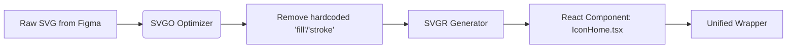

# Icons System

Система иконок — это стандартизированный конвейер поставки и рендеринга векторной графики в приложении. Это не просто папка `src/icons` с наваленными SVG-файлами, а строго типизированный набор React-компонентов (или веб-компонентов), которые умеют адаптироваться под контекст (цвет, размер) и не раздувают размер бандла.

## Какую боль мы решаем?
Без системы иконки живут своей жизнью: одни вставляются через ``, другие как `<svg>` прямо в разметку, третьи через иконочные шрифты. Они имеют разные `viewBox`, не выровнены по базовой линии текста (из-за чего кнопки кажутся кривыми) и не умеют краситься в нужный цвет при наведении. Система приводит всё к единому знаменателю.

## Как это работает на практике
Пайплайн обычно выглядит так:
1. Дизайнеры отдают "сырые" SVG.
2. Скрипт прогоняет их через SVGO (чистит от мусора, удаляет хардкод-цвета, заменяя их на `currentColor`).
3. Генератор (например, SVGR) превращает их в React-компоненты.
4. Создается единый компонент `<Icon>`, который инкапсулирует логику размеров и доступности.



## Антипаттерн vs Правильное решение

❌ **Антипаттерн: Ручной инлайн SVG с жесткими цветами**
```tsx
// Плохо: код мусорный, цвет зашит, размер нельзя изменить пропсом.
<button>
  <svg width="24" height="24" viewBox="0 0 24 24" fill="none">
    <path d="..." fill="#FF0000" />
  </svg>
  Удалить
</button>
```

✅ **Правильное решение: Универсальный компонент с currentColor**
```tsx
// Хорошо: Иконка берет цвет текста (color: red) из родителя, размер задан дизайн-токенами.
<Button variant="danger" icon={<Icon name="trash" size="small" />}>
  Удалить
</Button>
```

## Неочевидные нюансы и границы применимости
- **Проблема Tree-shaking:** Распространенная ошибка — экспортировать все иконки из одного `index.ts`. Если сборщик (Webpack) настроен не идеально, вы притянете сотни килобайт иконок в бандл, даже если использовали одну. Правильно настраивать импорты или использовать бандлеры, поддерживающие глубокий tree-shaking (Vite, Rollup).
- **Иконочные шрифты мертвы:** Раньше (в эпоху FontAwesome) иконки собирали в специальный шрифт для оптимизации запросов. Сейчас это антипаттерн: шрифты не поддерживают многоцветность, их сложно обновлять, и они приводят к проблемам доступности (экранные дикторы читают их как непонятные символы). Только инлайн SVG.
- **Оптический баланс:** Математически выровненная по центру иконка в кнопке визуально может казаться смещенной из-за особенностей её формы (например, иконка `play` треугольная). Система должна позволять вносить оптические корректировки (микро-сдвиги).
