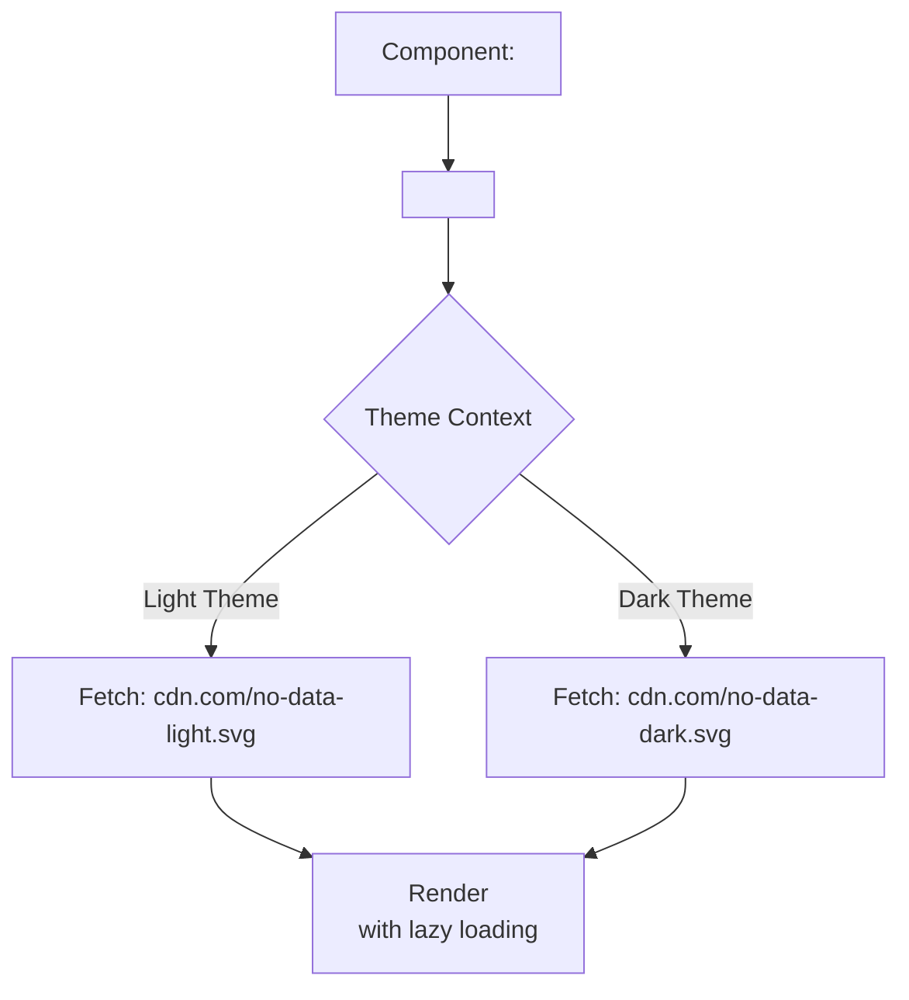

# Illustrations System

В отличие от иконок (маленьких, монохромных, векторных элементов интерфейса), иллюстрации — это крупные, детализированные, часто многоцветные или растровые изображения (заглушки для пустых состояний, баннеры, онбординг-графика). Система иллюстраций описывает правила их хранения, доставки и адаптации под темы (светлую/темную).

## Какую боль мы решаем?
Иллюстрации тяжелые. Если засунуть 10 векторных иллюстраций по 300КБ прямо в React-компоненты (как мы делаем с иконками), JavaScript бандл раздуется до неприличия, и страница будет грузиться вечность. Кроме того, иллюстрации для темной темы часто требуют полного перекрашивания, что сложно сделать одним CSS-фильтром.

## Как это работает на практике
Иллюстрации выносятся из JS-кода. Они хранятся как статические файлы (в папке `public` или на CDN). Компонент `Illustration` выступает просто умной оберткой над тегом `` (или `next/image`), которая поддерживает ленивую загрузку (lazy loading) и умеет подменять URL в зависимости от активной темы приложения.



## Антипаттерн vs Правильное решение

❌ **Антипаттерн: Инлайн иллюстраций в бандл**
```tsx
// Плохо: Огромный SVG зашивается в JS, парсится браузером при загрузке страницы, убивая TTI.
import { ReactComponent as HugeIllustration } from './huge.svg';

export const Welcome = () => (
  <div><HugeIllustration /></div>
);
```

✅ **Правильное решение: Статическая отдача и Lazy Loading**
```tsx
// Хорошо: Файл грузится по сети только когда попадает в область видимости.
export const Welcome = () => (
  <Illustration 
    name="welcome-banner" 
    loading="lazy" 
    alt="Welcome to the app" 
  />
);
```

## Скрытые трейдоффы и границы применимости
- **Мерцание при переключении темы (FOUC):** Если вы меняете тему на лету, новые иллюстрации для темной темы нужно скачать по сети. В этот момент пользователь может увидеть моргание старой картинки. Решение: предзагрузка (`<link rel="preload">`) или использование инлайн-CSS переменных прямо внутри SVG для перекраски без смены файла (но это требует сложных манипуляций с SVG).
- **Разрешение и форматы:** Для растра (PNG) необходимо отдавать разные форматы в зависимости от экрана (Retina 2x, 3x) и браузера (WebP, AVIF). Система должна автоматизировать генерацию `srcset` через компонент `<picture>`.
- **Base64 — зло для иллюстраций:** Встраивание крупных картинок в Data URI увеличивает размер файла примерно на 30% и блокирует парсинг HTML/JS. Никогда не делайте это для иллюстраций.
