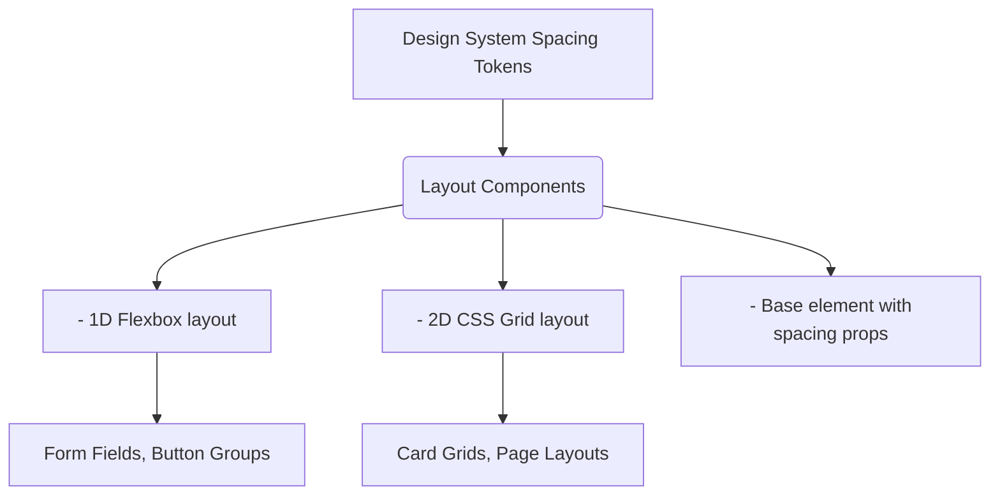

# Layout System

Layout System (Система сеток и раскладки) — это набор абстракций, отвечающий за позиционирование элементов на странице и управление отступами. Вместо того чтобы писать CSS для каждого контейнера, разработчики используют специальные компоненты-примитивы (Box, Stack, Grid, Container), которые настраиваются через пропсы, строго привязанные к дизайн-токенам.

## Какую боль мы решаем?
Отступы (margin и padding) — самая частая причина "развала" верстки и несоответствия дизайна коду. Кто-то делает отступ 15px, кто-то 16px. Кто-то задает `margin-top` у дочернего элемента, кто-то `padding-bottom` у родительского (из-за чего возникают margin collapse баги). Layout System отбирает у разработчиков возможность задавать произвольные отступы и заставляет использовать стандартизированные контейнеры.

## Как это работает на практике
В основе лежат компоненты, инкапсулирующие Flexbox и CSS Grid. Например, компонент `Stack` (или `Flex`) располагает дочерние элементы в линию с заданным промежутком (`gap`), который берется из токенов (например, `gap="md"` = `16px`).



## Антипаттерн vs Правильное решение

❌ **Антипаттерн: CSS-лапша для отступов**
```tsx
// Плохо: Магические классы и числа, сложно понять структуру без просмотра CSS.
<div className="card-wrapper">
  <h2 style={{ marginBottom: '12px' }}>Заголовок</h2>
  <div className="actions" style={{ display: 'flex', marginTop: '24px' }}>
    <button className="mr-4">Отмена</button>
    <button>Сохранить</button>
  </div>
</div>
```

✅ **Правильное решение: Декларативная Layout System**
```tsx
// Хорошо: Смысл разметки понятен сразу. Используются только разрешенные токены отступов.
<Stack direction="column" gap="lg">
  <h2>Заголовок</h2>
  <Stack direction="row" gap="sm">
    <Button variant="secondary">Отмена</Button>
    <Button>Сохранить</Button>
  </Stack>
</Stack>
```

## Неочевидные нюансы и границы применимости
- **Оверхед на DOM-узлы:** Чрезмерное использование оберток вроде `<Box>` и `<Stack>` для каждого чиха приводит к "DOM hell" — глубоким вложенностям дерева элементов. Это может бить по производительности рендеринга сложных таблиц или длинных списков.
- **Производительность CSS-in-JS:** Если Layout-компоненты построены на базе runtime CSS-in-JS (как styled-components), генерация новых классов "на лету" при изменении пропсов (например, в анимациях) вызовет фризы. В таких случаях лучше использовать системы на основе утилитных классов (по типу Tailwind) или CSS-переменных.
- **Нарушение инкапсуляции:** Компонент сам по себе не должен иметь внешних отступов (`margin`). Он не знает, где будет использоваться. Управлять его расположением должен внешний Layout-компонент.
