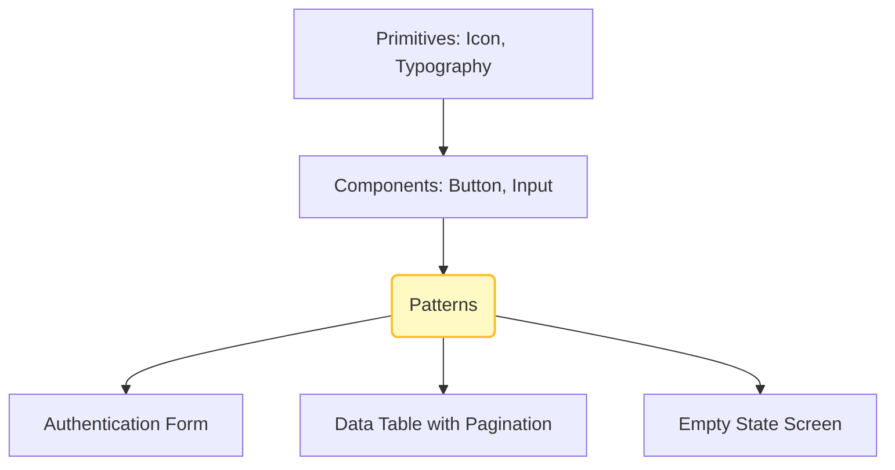

# Patterns (Паттерны)

В иерархии дизайн-систем паттерны (или шаблоны) стоят на ступеньку выше базовых компонентов. Если `Button` и `Input` — это кирпичи, то Паттерн — это готовая стена с окном. Это композиция из нескольких компонентов, решающая конкретную, часто повторяющуюся пользовательскую задачу: например, "Форма входа", "Шапка приложения (Header)", "Карточка товара" или "Таблица с пагинацией и фильтрами".

## Какую боль мы решаем?
Даже имея идеальные базовые компоненты, разные команды могут собирать из них разные интерфейсы для одних и тех же задач. Одна команда в "Карточке пользователя" поместит аватарку слева, другая — сверху. Это создает фрагментацию пользовательского опыта (UX). Паттерны кодифицируют лучшие практики продукта, гарантируя, что стандартные флоу выглядят и работают одинаково по всему приложению.

## Как это работает на практике
Паттерны документируются в Storybook не просто как набор пропсов, а как полноценные "рецепты" (Recipes) с описанием бизнес-логики. Иногда они оформляются в виде "умных" React-компонентов (содержащих стейт), иногда — как набор сниппетов кода, которые разработчик копирует и адаптирует под себя.



## Антипаттерн vs Правильное решение

❌ **Антипаттерн: Копипаста сложной логики**
```tsx
// Плохо: Разработчик копирует 200 строк кода из другого модуля, чтобы создать страницу с ошибкой, забывая про часть состояний.
<div className="error-page-wrapper">
  
  <h1>{errorTitle}</h1>
  <Button onClick={() => history.goBack()}>Назад</Button>
</div>
```

✅ **Правильное решение: Использование Паттерна из дизайн-системы**
```tsx
// Хорошо: Вся логика центрирования, отступов и роутинга зашита в паттерне.
import { ErrorPagePattern } from '@ui-platform/patterns';

<ErrorPagePattern 
  type="404" 
  onActionClick={() => router.push('/')} 
/>
```

## Скрытые трейдоффы и границы применимости
- **Синдром "Божественного компонента" (God Component):** Если пытаться вынести сложный паттерн (например, "Таблицу") в единый NPM-пакет, со временем продуктовые команды начнут просить добавить специфичные флаги (например, `hideColumnOnTuesdays={true}`). Паттерн разрастется до монстра, которого невозможно поддерживать.
- **Inversion of Control (IoC):** Для сложных паттернов лучше использовать подход Compound Components или Render Props, отдавая контроль над рендерингом внутренностей обратно разработчику, а не прятать все за сотней пропсов конфигурации.
- **Паттерны ломаются о специфику:** Паттерн идеален для админок и B2B. В промо-сайтах и B2C с уникальным дизайном паттерны чаще мешают, так как дизайнер всегда хочет сделать "по-другому, чтобы выделяться".
