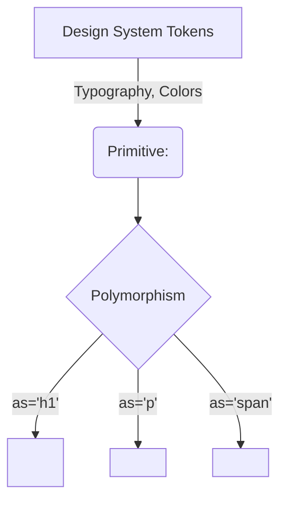

# Primitives (Примитивы)

В архитектуре дизайн-систем Примитивы — это атомарные, фундаментальные кирпичики интерфейса. Если `Button` — это базовый компонент, то Примитив — это то, из чего он состоит (например, `Text`, `Icon`, `Spinner`). Примитивы не несут бизнес-логики, они максимально тупые и занимаются только маппингом пропсов в CSS-классы или стили, опираясь на дизайн-токены.

## Какую боль мы решаем?
Когда вы строите дом, вы не хотите каждый раз отливать новый тип кирпича. Без примитивов разработчики хардкодят стили: пишут `<span style={{ fontSize: 14, fontWeight: 500 }}>` внутри модалки. Примитив `<Text variant="body1">` инкапсулирует типографику, гарантируя, что по всему приложению используется консистентный шрифт, высота строки и цвет.

## Как это работает на практике
Примитивы обычно строятся с использованием полиморфизма (проп `as` или `component`), чтобы разработчик мог рендерить правильный семантический HTML-тег, сохраняя при этом стили примитива.



## Антипаттерн vs Правильное решение

❌ **Антипаттерн: Размытие ответственности (слишком умный примитив)**
```tsx
// Плохо: Примитив `Text` не должен знать про отсечение текста, тултипы и обработку кликов.
<Text 
  variant="body" 
  truncateAfterLines={2} 
  showTooltipOnHover={true} 
  onClick={sendAnalyticsEvent}
>
  Очень длинный текст
</Text>
```

✅ **Правильное решение: Строгий маппинг токенов**
```tsx
// Хорошо: Примитив отвечает только за внешний вид. Остальное — композиция.
<Tooltip content="Очень длинный текст">
  <Text as="p" variant="body" color="textSecondary" className="line-clamp-2">
    Очень длинный текст
  </Text>
</Tooltip>
```

## Неочевидные нюансы и границы применимости
- **Взрыв комбинаций пропсов:** Легко увлечься и добавить в примитив `Text` пропсы `margin`, `padding`, `display`, `position`. В итоге ваш `<Text>` превратится в `<Box>`, что размывает границы абстракции.
- **Оверхед на рендеринг:** Использование React-примитивов для каждого слова на экране увеличивает размер виртуального DOM. В таблицах с тысячами строк использование `<Text>` для каждой ячейки может замедлить рендеринг в несколько раз по сравнению с обычным `<span>` с классом.
- **Escape Hatches:** Примитивы должны поддерживать проброс кастомных классов (`className`), так как предсказать все 100% юзкейсов отступов или позиционирования в рамках дизайн-системы невозможно.
