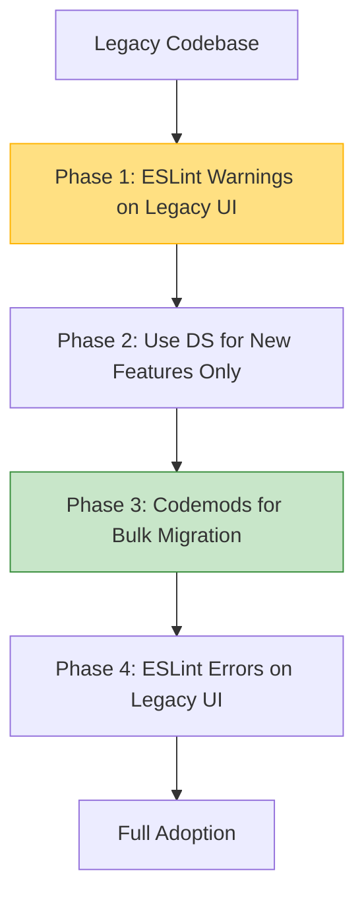

# Adoption Strategy (Стратегия внедрения)

Adoption Strategy — это план того, как заставить продуктовые команды добровольно (или не очень) начать использовать компоненты и токены вашей новой дизайн-системы (ДС) вместо своих кастомных "велосипедов". Это скорее социо-инженерная, чем чисто техническая задача.

## Какую боль мы решаем?
Многие крутые дизайн-системы умирают, так и не родившись. Инфраструктурная команда тратит 6 месяцев на разработку идеальной кнопки, выкатывает её, а продуктовые разработчики говорят: "Спасибо, но нам некогда переписывать старый код, у нас релиз". В итоге ДС становится "вещью в себе". Стратегия внедрения отвечает на вопрос: как перевезти продукт на новые рельсы, не останавливая доставку бизнес-фич.

## Как это работает на практике
Внедрение строится на метриках, плавном переходе и "тропах наименьшего сопротивления". Вместо того чтобы заставлять переписывать весь проект, команды договариваются: "Все новые фичи пишем только на компонентах ДС". Пишутся ESLint-правила, которые запрещают импортировать старую кнопку или использовать голый `#FF0000` в CSS, предлагая автофикс на использование `var(--primary)`.



## Антипаттерн vs Правильное решение

❌ **Антипаттерн: "Стоп-машина" и переписывание**
```bash
# Руководитель объявляет: 
# "Следующий спринт мы ничего не релизим, переписываем весь UI на новую библиотеку!"
# Итог: бизнес теряет деньги, миграция затягивается на месяцы, вылезают сотни багов верстки.
```

✅ **Правильное решение: Плагины миграции (Codemods) и Линтинг**
```json
// .eslintrc.js
// Разрешаем использование старой кнопки, но мягко "бьем по рукам" за новые инстансы
"rules": {
  "no-restricted-imports": ["warn", {
    "paths": [{
      "name": "src/legacy/Button",
      "message": "Please use @design-system/Button instead."
    }]
  }]
}
```

## Неочевидные нюансы и границы применимости
- **Измерение Adoption:** Без метрик вы не знаете, пользуются ли вашей ДС. Продвинутые команды пишут CLI-скрипты, которые сканируют AST репозиториев и строят дашборды в Grafana: "В проекте A 80% компонентов из ДС, а в проекте B — только 20%".
- **Локальные копии:** Если в ДС нет нужного компонента, разработчики копируют его исходники к себе в проект, модифицируют и используют. Это "скрытый" технический долг, который портит статистику внедрения. Решается через Contribution Model.
- **Поддержка старого:** Невозможно просто удалить старую версию кнопки. Вам придется долгое время поддерживать обе версии, маркируя старую как `@deprecated`.
