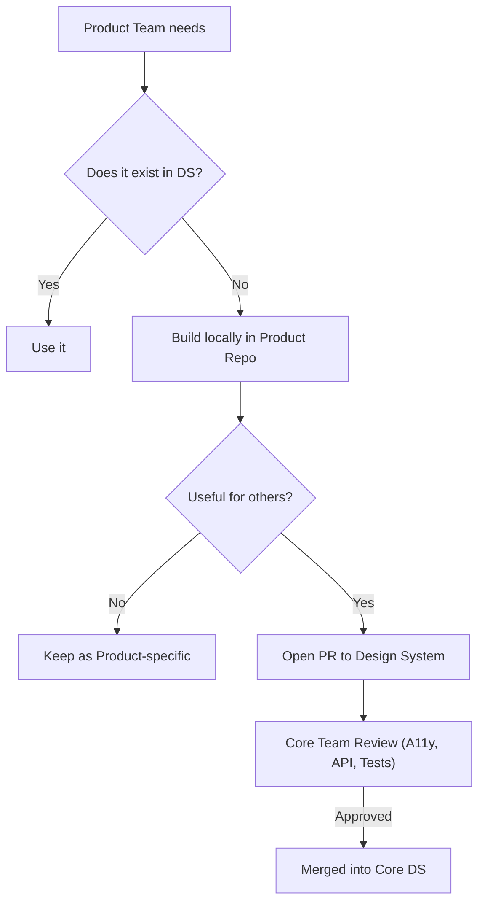

# Contribution Model (Модель контрибьюции)

Contribution Model — это процесс, регламентирующий то, как сторонние разработчики (из продуктовых команд) могут добавлять новые компоненты или изменять существующие в ядре дизайн-системы (ДС). Это ответ на извечный вопрос: "В ДС нет компонента `<Timeline>`, кто должен его написать?".

## Какую боль мы решаем?
Если ДС пилит выделенная "кор-команда", она всегда становится узким горлышком (bottleneck). Продуктовой команде нужен новый календарь "еще вчера", а кор-команда говорит: "Положите в бэклог, сделаем через месяц". В результате продуктовики пишут костыль у себя.
И наоборот: если разрешить кому попало пушить код прямо в ДС, она быстро превратится в помойку с конфликтующими стилями, отсутствием тестов и сломанным API.

## Как это работает на практике
Обычно применяется гибридная модель с механизмом "инкубации".
Продуктовая команда пишет нужный ей компонент у себя локально (в папке `src/components/incubator`). Они решают свою бизнес-задачу. Позже, если компонент оказывается нужным другим командам, они открывают Pull Request в репозиторий ДС. Кор-команда проводит код-ревью, проверяет доступность (a11y) и соответствие токенам, после чего принимает компонент в ядро.



## Антипаттерн vs Правильное решение

❌ **Антипаттерн: Жесткая централизация**
Только 3 человека из Core-команды имеют права на коммит в ДС. Любое изменение пропса в кнопке требует создания тикета в Jira, ожидания спринта и согласования. Продукты саботируют ДС.

✅ **Правильное решение: Внутренний Open Source (InnerSource)**
Репозиторий ДС открыт для всех. Любой может прислать PR.
```markdown
<!-- PULL_REQUEST_TEMPLATE.md в репозитории ДС -->
## Описание компонента
- [x] Компонент решает общую задачу, а не бизнес-логику одного продукта
- [x] Добавлена история в Storybook
- [x] Написаны тесты (минимум 80% coverage)
- [x] Дизайн согласован с дизайн-лидом
```

## Неочевидные нюансы и границы применимости
- **Мотивация к контрибьюции:** Написание компонента по стандартам ДС занимает в 3-4 раза больше времени, чем "накостылить" его локально (нужно писать документацию, тесты, a11y). Продуктовые менеджеры часто не хотят оплачивать этот банкет из своего бюджета времени. Требуется политическая воля сверху.
- **Поддержка после слияния:** Кто чинит баги в компоненте `<Timeline>` после того, как его влили в ДС? Та команда, что его принесла, или Core-команда? Это нужно прописывать в "договоре" (Governance). Обычно ответственность за поддержку забирает Core-команда.
- **Инкубатор как кладбище:** Папка `incubator` часто превращается в свалку недоделанных компонентов, до которых у авторов так и не дошли руки, чтобы довести их до стандартов ДС.
