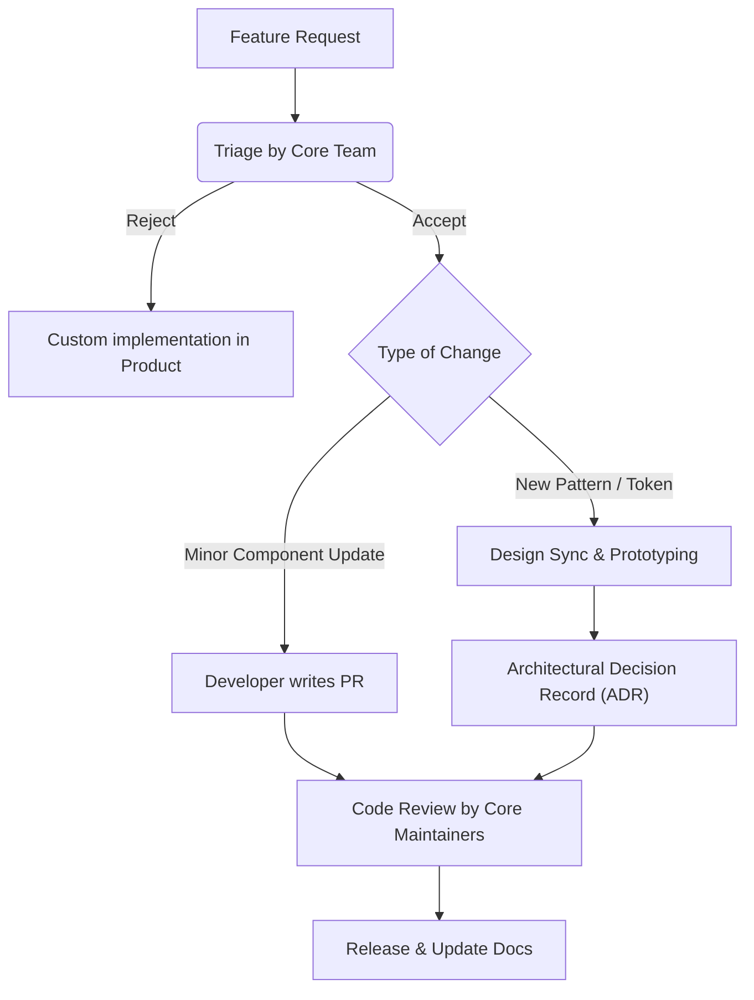

# Governance (Управление дизайн-системой)

Governance — это набор правил, ролей и процессов, определяющих, как дизайн-система живет, развивается и кем контролируется. Это "бюрократический" аппарат, который защищает систему от хаоса, но при этом не должен превратиться в неповоротливого монстра.

## Какую боль мы решаем?
Без Governance система деградирует. Дизайнер А добавляет новый оттенок синего без согласования. Разработчик Б добавляет кнопке проп `isSuperBig`, потому что "так нужно бизнесу". Через год дизайн-система превращается в набор разрозненных хаков, который невозможно поддерживать и масштабировать. Governance определяет, кто принимает решения: как добавляются новые токены, как происходит версионирование и как решаются споры (например, если продукт требует нарушить гайдлайны).

## Как это работает на практике
Governance реализуется через создание "Комитета" (или Core-команды), состоящего из лид-дизайнеров и лид-разработчиков. Они проводят регулярные ревью (Design System Syncs), управляют бэклогом и следят за качеством.



## Антипаттерн vs Правильное решение

❌ **Антипаттерн: Анархия и "каждый сам за себя"**
Нет единого владельца (Owner). Любой разработчик пушит изменения в мастер, ломая верстку в соседних проектах. Версионирование не соблюдается.

✅ **Правильное решение: Институционализация процессов (ADR и RFC)**
Перед крупным изменением (например, переезд на новую систему токенов) пишется Request for Comments (RFC), который обсуждается сообществом. Принятое решение фиксируется в ADR.
```markdown
# ADR 14: Переход с CSS Modules на Tailwind-подобный движок
**Статус:** Принято
**Контекст:** Наша текущая система токенов тяжело портируется в React Native.
**Решение:** Мы внедряем Style Dictionary и платформо-агностичные JSON-токены.
**Последствия:** ...
```

## Скрытые трейдоффы и границы применимости
- **Бюрократия vs Скорость (Time-to-Market):** Жесткий Governance (согласование каждого чиха с техкомом) замедляет разработку продуктовых фич. Хороший Governance должен предусматривать "Escape Hatches" (аварийные выходы) — легальные способы нарушить правила системы локально, с обязательством выплатить технический долг позже.
- **Отсутствие выделенных людей:** Если Governance висит на энтузиастах, у которых 100% времени занято продуктовыми задачами, процессы быстро отмирают. Комитет должен иметь официально выделенные часы (например, 20% времени).
- **Диктатура vs Демократия:** Централизованная модель (диктатура кор-команды) дает идеальную консистентность, но бесит продукты. Децентрализованная (все правят всё) дает скорость, но убивает консистентность. Золотой середины нет, она плавает в зависимости от зрелости компании.
