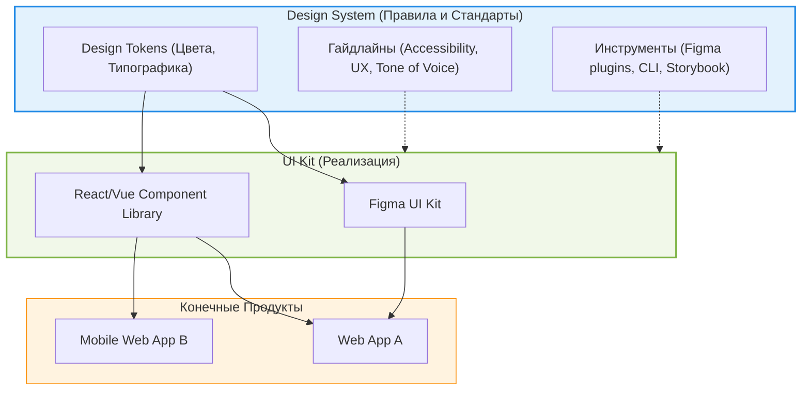

# UI Kit и Design System

В индустрии часто путают термины "UI Kit" (библиотека компонентов) и "Design System" (дизайн-система). Понимание разницы между ними — ключ к правильному масштабированию фронтенд-архитектуры и выстраиванию процессов между дизайном и разработкой.

## 1. В чем разница? (Суть концепции)

**UI Kit** — это набор готовых пользовательских интерфейсов. Это кирпичи: кнопки, поля ввода, чекбоксы. Он существует как в дизайне (Figma-файл), так и в коде (npm-пакет с React/Vue компонентами).

**Design System** — это экосистема, которая включает в себя UI Kit, но идет гораздо дальше. Это чертежи, правила сборки, строительные нормы и философия. 

### Боль, которую мы решаем:
Если у вас есть только UI Kit, команды будут собирать из одинаковых кирпичей совершенно разные здания. Кнопки будут везде одинаковыми, но отступы между ними, паттерны валидации форм и поведение модальных окон будут различаться от страницы к странице. Дизайн-система решает проблему *консистентности пользовательского опыта (UX)*.

## 2. Архитектура взаимосвязей



## 3. Практический пример: От UI Kit к Системе

**Уровень UI Kit (Просто компонент):**
```tsx
// Разработчик просто берет кнопку. 
// Как ее применять в контексте формы — непонятно.
import { Button } from '@company/ui-kit';

<Button variant="primary" onClick={submit}>Сохранить</Button>
```

**Уровень Дизайн-системы (Паттерны и правила):**
Дизайн-система определяет не только саму кнопку, но и *паттерн* ее использования. Например, гайдлайн гласит: "В формах основная кнопка действия всегда находится справа, а вторичная (Отмена) — слева".

```tsx
// Разработчик использует системный паттерн (композицию), 
// который гарантирует правильное расположение кнопок во всех формах.
import { FormActions, Button } from '@company/design-system';

<FormActions>
  <Button variant="secondary" onClick={cancel}>Отмена</Button>
  <Button variant="primary" onClick={submit}>Сохранить</Button>
</FormActions>
```

## 4. Специфика и неочевидные нюансы

### 4.1. "Слепое" использование UI Kit
Самый частый антипаттерн — когда команда берет открытый UI Kit (MUI, AntD, Chakra) и называет его своей "Дизайн-системой". 
*   **Почему это плохо:** MUI не знает специфики вашего бизнеса. Если вы просто используете его компоненты, вы зависите от решений создателей MUI, а не от потребностей ваших пользователей.
*   **Как надо:** Использовать MUI как *базовый слой* (headless или styled), но поверх него выстраивать собственные компоненты, токены и паттерны, отражающие вашу бизнес-логику (создавать свой UI Kit на базе чужого).

### 4.2. Трейдофф: Эволюция vs Стабильность
*   **UI Kit** относительно легко обновлять. Добавил новый пропс кнопке, выпустил patch-версию.
*   **Дизайн-система** обновляется тяжело. Изменение гайдлайнов или логики дизайн-токенов может затронуть сотни макетов и репозиториев. Требуется строгая стратегия версионирования и миграции (коды-моды, deprecated-ворнинги).

### 4.3. Границы применимости
*   **UI Kit нужен почти всегда**, даже на ранних этапах. Вынести общую кнопку в отдельный файл — это уже микро-UI Kit, который спасает от дублирования кода.
*   **Дизайн-система нужна только при масштабировании**, когда количество экранов и участников команды переваливает за отметку, где устные договоренности перестают работать.
