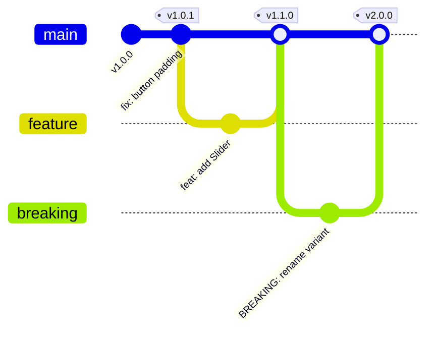

# Версионирование дизайн-системы

Версионирование (обычно по правилам Semantic Versioning — SemVer) — это контракт между создателями дизайн-системы и продуктовыми разработчиками. Оно гарантирует предсказуемость обновлений: разработчик должен знать, сломает ли очередное обновление `npm install @ui/button` его код или только исправит баги.

## Какую боль мы решаем?
Если дизайн-система обновляется хаотично ("просто скачай последнюю версию"), каждое обновление превращается в рулетку. Вчера кнопка была синей и принимала `text`, сегодня стала зеленой и требует `children`. Версионирование дает контроль: продукты могут безопасно получать багфиксы (патч-версии) и планировать время на миграцию (мажорные версии).

## Как это работает на практике
В мире SemVer версия имеет вид `MAJOR.MINOR.PATCH` (например, `2.14.3`). Для дизайн-системы правила трактуются так:
- **PATCH (2.14.4):** Исправлен баг a11y в модалке, визуально ничего не изменилось, API старое.
- **MINOR (2.15.0):** Добавлен новый компонент `<DateRangePicker>` или новый не ломающий проп `isLoading` в кнопку.
- **MAJOR (3.0.0):** Удален компонент, переименован проп, либо кардинально изменен дизайн (ребрендинг), который ломает верстку в продуктах.

## Антипаттерн vs Правильное решение

❌ **Антипаттерн: Визуальные изменения как "Patch"**
Дизайнер решил увеличить радиус скругления всех кнопок с `4px` до `8px`. Команда выпускает версию `1.0.2`. В результате у продуктовых команд ломаются pixel-perfect тесты и визуальные регрессии, хотя по правилам патч-версия не должна этого делать.

✅ **Правильное решение: Строгий контракт на дизайн-токены**
Изменение визуального веса (размеры, отступы, кардинальная смена цвета) расценивается как `MINOR` (если не ломает Layout) или `MAJOR` (если ломает сетку).

## Скрытые трейдоффы и границы применимости
- **Монорепа vs Раздельные пакеты:** Если ДС состоит из 50 пакетов (`@ui/button`, `@ui/input`), версионировать каждый отдельно (Independent) — это ад для поддержки консистентности зависимостей. Лучше использовать единую версию (Fixed/Locked), как делают Babel или React: обновляете `button` до `v3`, значит и `input` обновляете до `v3`.
- **Заморозка старых версий:** Выпустив `v2.0.0`, вы не можете бросить `v1.0`. Вам придется бэкпортировать критические багфиксы в ветку `v1.x`, так как крупные продукты (например, монолиты) могут переезжать на мажорную версию годами.
- **Усталость от обновлений (Update Fatigue):** Если выпускать `MAJOR` версии каждый месяц, продукты просто перестанут обновляться, и ваша дизайн-система фрагментируется. Мажорные релизы нужно собирать в батчи и выпускать не чаще 1-2 раз в год.
