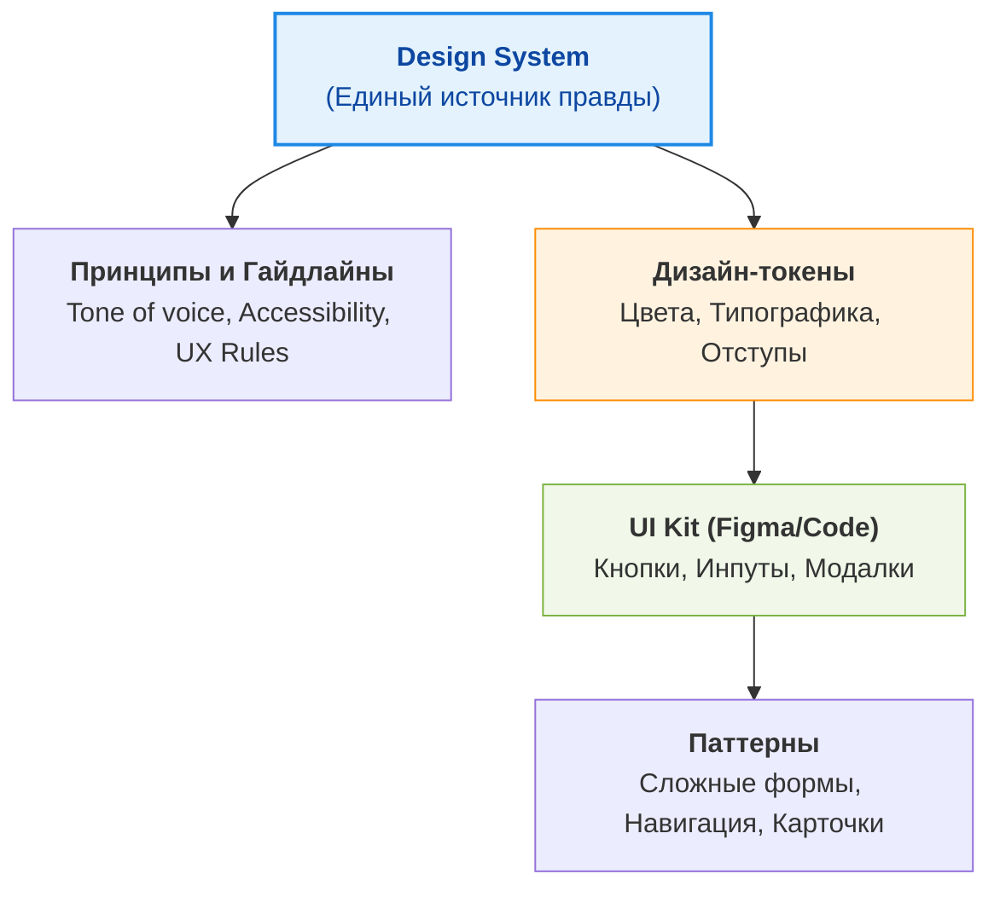

# Зачем нужна Design System

Дизайн-система (Design System) — это единый источник правды, объединяющий визуальный язык, компоненты, паттерны и правила их использования, созданный для масштабирования UI/UX на уровне всей компании. Это не просто библиотека компонентов, а полноценный продукт для создания других продуктов.

## 1. Какую боль мы решаем?

Когда компания растет, фронтенд и дизайн сталкиваются с хаосом:
*   **Эффект Франкенштейна:** Три разные кнопки "Купить", пять оттенков синего и разные отступы на соседних страницах.
*   **Дороговизна разработки:** Каждая новая фича требует написания UI-компонентов с нуля.
*   **Рассинхрон дизайна и кода:** Дизайнеры рисуют в Figma одни тени, а разработчики в CSS пишут другие.
*   **Сложность онбординга:** Новым разработчикам непонятно, как стилизовать формы и где брать иконки.

Дизайн-система устраняет этот хаос, превращая UI в предсказуемый конструктор.

## 2. Анатомия Дизайн-системы



## 3. Практический пример: Использование Токенов

**Антипаттерн (Хаос в коде):**
```css
/* Разработчик использует случайные значения, не опираясь на систему */
.button {
  background-color: #007bff; /* Жестко зашитый цвет */
  padding: 10px 15px; /* Магические числа */
  border-radius: 4px;
}
```

**Как надо (С использованием дизайн-системы):**
```css
/* Использование семантических токенов */
.button {
  background-color: var(--color-primary-main);
  padding: var(--spacing-sm) var(--spacing-md);
  border-radius: var(--radius-base);
}
```

Благодаря такому подходу, если бренд-команда решает изменить основной цвет с синего на фиолетовый, разработчикам достаточно обновить одно значение в файле токенов.

## 4. Специфика, трейдоффы и границы применимости

Несмотря на очевидную пользу, дизайн-система — это дорогостоящая инвестиция, которая нужна не всем.

### 4.1. Оверхед на поддержку (Governance)
Дизайн-система — это внутренний open-source продукт. Ей нужна выделенная команда (или хотя бы ответственные энтузиасты), версионирование, релиз-циклы и changelog. Без поддержки она быстро превращается в устаревшую библиотеку, которой никто не пользуется.

### 4.2. Скрытый трейдофф: Гибкость vs Унификация
*   **Унификация:** Разработчики ограничены готовыми компонентами. Это ускоряет работу, но убивает креативность на местах.
*   **Гибкость:** Если сделать компоненты слишком "умными" (например, добавить 50 пропсов кнопке для всех возможных случаев), их поддержка превратится в ад.
*   **Решение:** Строгие базовые компоненты (Primitives) и гибкие слоты/композиция вместо бесконечных пропсов.

### 4.3. Когда Дизайн-система НЕ нужна
*   **Стартап на стадии MVP:** Главная цель — найти Product-Market Fit. Тратить месяц на настройку Storybook и дизайн-токенов — верная смерть. Лучше взять готовый UI-фреймворк (MUI, Ant Design).
*   **Разовые промо-проекты и лендинги:** Здесь важен вау-эффект и уникальный дизайн, а не переиспользование кнопок.
*   **Один продукт, одна команда (до 3 разработчиков):** Достаточно простого UI Kit в коде и пары базовых гайдлайнов.

### 4.4. Когда она окупается
*   Компания разрабатывает несколько продуктов (семейство приложений).
*   В штате более 10-15 фронтенд-разработчиков и несколько дизайнеров.
*   Продукты имеют длительный жизненный цикл, и консистентность бренда становится бизнес-требованием.
