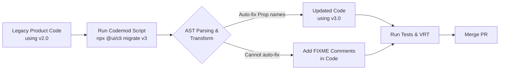

# Миграция между версиями (Migration & Codemods)

Мажорный релиз дизайн-системы (например, `v2.0` -> `v3.0`) всегда несет ломающие изменения (Breaking Changes). Переименовались токены, изменился API компонентов (вместо `color="blue"` стало `variant="primary"`). Миграция — это процесс безболезненного перевода продуктовых кодовых баз на новую мажорную версию.

## Какую боль мы решаем?
Когда в компании 50 микрофронтендов, простая замена пропса `isLarge` на `size="large"` во всех проектах руками займет месяцы человеко-часов. Разработчики будут ненавидеть создателей дизайн-системы за любую оптимизацию API. Чтобы снизить трение (friction), вместе с мажорным релизом поставляются скрипты автоматической миграции — Codemods.

## Как это работает на практике
Codemod (например, на базе `jscodeshift`) — это скрипт, который парсит исходный код (AST — Abstract Syntax Tree), находит использование старого API и автоматически переписывает его на новое, сохраняя форматирование. Разработчику остается только запустить команду и сделать ревью изменений.



## Антипаттерн vs Правильное решение

❌ **Антипаттерн: Миграция "через боль" (Только Changelog)**
```markdown
# CHANGELOG v3.0
- Кнопка: `type` переименован в `variant`.
Удачи переименовать это в ваших 10000 файлах!
```

✅ **Правильное решение: Автоматизация через AST**
```bash
# Разработчик в своем проекте запускает скрипт от команды платформы:
npx @ui-platform/codemod v3.0.0
# Скрипт сам находит `<Button type="primary">` и меняет на `<Button variant="primary">`
```

## Неочевидные нюансы и границы применимости
- **Сложные изменения архитектуры не автоматизируются:** Codemods идеальны для переименования пропсов или токенов. Но если вы изменили парадигму (например, перешли от конфиг-объектов `items={[...]}` к Compound Components `<Menu><MenuItem/></Menu>`), написать надежный парсер AST почти невозможно. В таких случаях скрипт должен хотя бы вставить комментарий `// TODO: Manual migration required` над проблемным местом.
- **Тесты падают после кодемодов:** Скрипт меняет исходный код, но часто не умеет менять моки в юнит-тестах или снэпшотах. Разработчикам все равно придется "допиливать" миграцию руками.
- **Поддержка Deprecation-периода:** Хорошим тоном является не удалять старое API сразу в `v3.0`, а пометить его как `@deprecated` (с выводом warning в консоль) еще в `v2.9`, чтобы дать командам время на плавный переезд до того, как код реально перестанет компилироваться.
