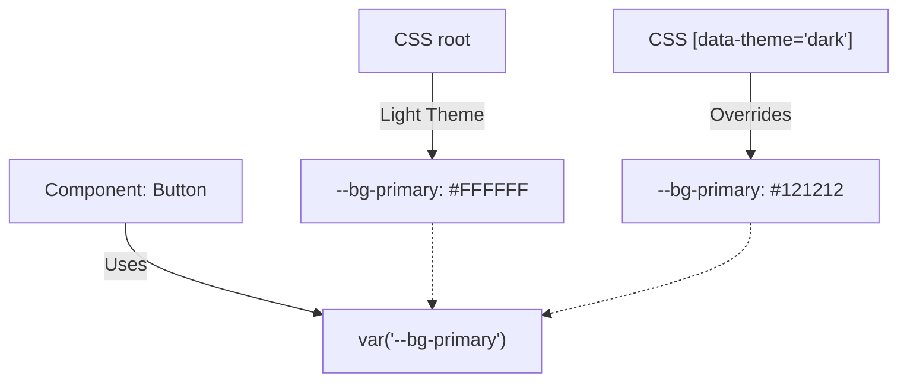

# Dark Mode (Темная тема)

Dark Mode (темная тема) — это альтернативный цветовой режим интерфейса, при котором светлый фон меняется на темный (серый/черный), а типографика — на светлую. Реализация темной темы на уровне дизайн-системы требует строгой архитектуры семантических токенов, иначе код превратится в кашу из условий `if (isDark)`.

## Какую боль мы решаем?
Без системного подхода темную тему делают "по месту": пишут инлайн-проверки или создают дублирующие CSS-классы (`.btn-dark`). При добавлении новой фичи разработчики забывают прописать темные стили, и на черном фоне появляется "вырвиглазная" белая панель. Архитектура на основе токенов позволяет переключать темы вообще не меняя код компонентов.

## Как это работает на практике
Вместо захардкоженных цветов (`#FFFFFF`), компоненты используют семантические CSS-переменные (например, `var("--bg-primary")`). В светлой теме переменная равна белому цвету, в темной — черному. Переключение темы — это просто добавление дата-атрибута `data-theme="dark"` на тег `<html>` или `<body>`.



## Антипаттерн vs Правильное решение

❌ **Антипаттерн: Переключение темы в JS-логике компонента**
```tsx
// Плохо: Раздувает размер компонента, требует контекста темы везде, 
// ломается при серверном рендеринге (SSR).
const Card = () => {
  const { isDark } = useTheme();
  return <div style={{ background: isDark ? '#000' : '#FFF' }}>Текст</div>
};
```

✅ **Правильное решение: Управление через CSS-переменные**
```css
/* Хорошо: Стили живут в CSS, компонент "глупый" и быстрый */
:root { --surface-color: #FFF; }
[data-theme="dark"] { --surface-color: #000; }
.card { background: var("--surface-color"); }
```

## Неочевидные нюансы и границы применимости
- **FOUC (Flash of Unstyled Content) при SSR:** Если вы используете Server-Side Rendering (Next.js) и храните выбор темы в `localStorage`, при первой загрузке сервер не знает, какую тему выбрал юзер (сервер не имеет доступа к localStorage). В результате рендерится светлая тема, которая через долю секунды на клиенте "моргает" в темную. Решается инжектом крошечного блокирующего скрипта `<script>` в `<head>`, который читает Storage до парсинга DOM.
- **Инверсия теней:** В темной теме классические `box-shadow` (черные тени) не работают на черном фоне. Тени в Dark Mode либо убирают вовсе, заменяя их тонкими бордерами (`border: 1px solid var("--border-divider")`), либо делают светящимися (что редко подходит для бизнес-UI).
- **Специфичность (Specificity):** Если вы используете CSS-in-JS (например, styled-components), смешивание с глобальными дата-атрибутами может породить войну специфичности. Часто в таких стеках тему прокидывают через `ThemeProvider`, но тогда возвращается проблема с производительностью ре-рендера всего дерева при переключении.
