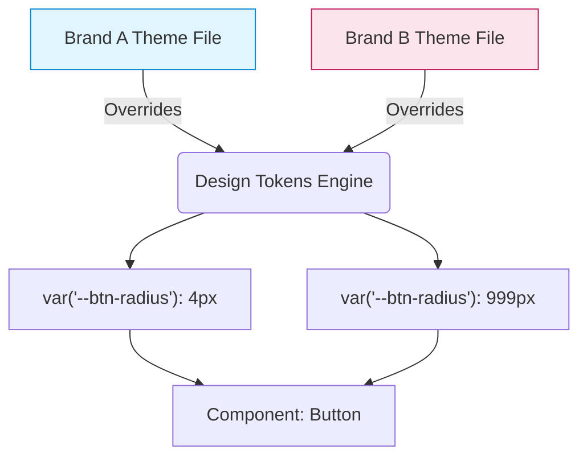

# Multi Brand Architecture (Мультибрендовая архитектура / White Label)

Мультибрендовая архитектура — это способность дизайн-системы (и построенных на ней продуктов) кардинально менять свой визуальный язык (цвета, шрифты, отступы, формы) для обслуживания разных торговых марок из одной кодовой базы. Например, компания "Ромашка" владеет брендами "Астра" и "Тюльпан". Интерфейсы одинаковые (корзина, каталог), но визуал абсолютно разный.

## Какую боль мы решаем?
Когда бизнес покупает другой бренд или запускает White-Label платформу (b2b-клиенты хотят приложение в "своих" цветах), разработчики часто начинают плодить ветки в Git или копировать проекты целиком. Это приводит к рассинхрону бизнес-логики: багфикс корзины нужно мержить в 10 разных репозиториев. Мультибрендовая ДС решает это через глубокую абстракцию токенов: логика одна, "шкурки" разные.

## Как это работает на практике
В основе лежит многоуровневая система токенов. Глобальные токены (Core) маппятся на семантические (Semantic), а те — на компонентные (Component). При смене бренда подменяется файл с токенами (обычно на этапе сборки, реже — в рантайме).



## Антипаттерн vs Правильное решение

❌ **Антипаттерн: CSS-классы с префиксами брендов**
```tsx
// Плохо: Раздувает код, требует знания о всех брендах внутри компонента.
const Header = ({ brand }) => (
  <header className={brand === 'astra' ? 'bg-blue' : 'bg-red'}>...</header>
);
```

✅ **Правильное решение: Бренд-агностичные семантические токены**
```tsx
// Хорошо: Компонент ничего не знает о брендах. Он просто использует "первичный" цвет.
// Подмена значений CSS-переменных --color-primary происходит на уровне сборщика или root-контейнера.
const Header = () => (
  <header style={{ backgroundColor: 'var("--color-primary")' }}>...</header>
);
```

## Неочевидные нюансы и границы применимости
- **Разлом семантики:** Мультибренд отлично работает, когда бренды отличаются только палитрой. Но если у "Бренда А" кнопка успешной оплаты зеленая (семантика Success), а у "Бренда Б" корпоративный цвет зеленый, и кнопка отмены тоже зеленая — семантические токены (`color-success` vs `color-brand`) начинают конфликтовать.
- **Build-time vs Runtime:** Если брендов 3-4 (внутренние бренды компании), дешевле собирать 4 разных бандла через Webpack/Vite (Build-time theming), вырезая лишний CSS. Если это SaaS-платформа, где клиенты сами настраивают цвета в админке, нужен Runtime theming (CSS Variables, инжектируемые с бэкенда), что ограничивает возможность использования препроцессоров (Sass).
- **Структурные отличия:** Если "Бренд А" требует хедер сверху, а "Бренд Б" — сайдбар сбоку, система токенов тут не спасет. Потребуется выносить Layout-композицию на уровень самого приложения, используя "глупые" компоненты из ДС.
