# Multi Theme Architecture

Multi Theme Architecture — это архитектурный подход, позволяющий дизайн-системе поддерживать множество различных визуальных тем (светлая, темная, высококонтрастная для слабовидящих, тема "ретро" и т.д.) в рамках одного приложения. В отличие от мультибрендовости (где меняется сам продукт), мульти-темизация — это выбор пользователя внутри одного продукта.

## Какую боль мы решаем?
Когда продукт изначально писался только под одну тему (например, светлую), цвета жестко "запекаются" в компонентах. При попытке добавить темную тему, разработчики начинают дублировать CSS или писать страшные конструкции вида `props.theme === 'dark' ? '#000' : '#FFF'`. Мульти-темная архитектура выносит всю палитру на уровень абстрактных токенов (семантических), отвязывая компоненты от конкретных HEX-значений.

## Как это работает на практике
Используется трехуровневая система токенов:
1. **Global Tokens:** `#FFFFFF`, `#000000`.
2. **Semantic Tokens:** `color-bg-primary`, `color-text-danger`.
3. **Themes:** Маппинг семантических токенов на глобальные. Например, в теме "Light" `color-bg-primary` указывает на белый, в "Dark" — на черный.

```mermaid
graph TD
    A["Semantic Token: var('--text-color')"] --> B["Theme Context"]
    B -->|"data-theme='light'"| C["Global: var('--gray-900')"]
    B -->|"data-theme='dark'"| D["Global: var('--gray-100')"]
    B -->|"data-theme='high-contrast'"| E["Global: #000000"]
    
    style C fill:#ffffff,stroke:#000
    style D fill:#424242,stroke:#fff
    style E fill:#ffff00,stroke:#000,stroke-width:3px
```



## Антипаттерн vs Правильное решение

❌ **Антипаттерн: CSS-классы под каждую тему**
```css
/* Плохо: Размер CSS-файла растет линейно с добавлением каждой новой темы */
.card { background: #FFF; }
.theme-dark .card { background: #333; }
.theme-high-contrast .card { background: #000; border: 2px solid yellow; }
```

✅ **Правильное решение: Маппинг через CSS-переменные**
```css
/* Хорошо: CSS компонента остается неизменным, меняются только корневые переменные */
.card { background: var("--surface-bg"); }

:root[data-theme="dark"] { --surface-bg: #333; }
:root[data-theme="high-contrast"] { --surface-bg: #000; }
```

## Неочевидные нюансы и границы применимости
- **Разрыв семантики:** При создании высококонтрастной темы (High Contrast) часто недостаточно просто поменять цвета. Например, легкая серая тень (`box-shadow`), которая отделяла карточку в светлой теме, в High Contrast теме становится невидимой. Приходится заменять тень на жесткий `border`, что ломает парадигму чисто цветовой темизации и требует условной логики в стилях.
- **Ограничения CSS-переменных:** Если вы хотите использовать функции прозрачности (например, `rgba("var(--color"), 0.5)`), вам придется хранить в переменных не HEX-коды (`#FF0000`), а RGB-каналы (`255, 0, 0`), что сильно ухудшает читаемость кода (Developer Experience).
- **Разрастание палитры:** Поддержка 4-5 тем замедляет работу дизайнеров: каждую новую фичу или иллюстрацию нужно проверять и адаптировать под все темы, иначе интерфейс сломается.
