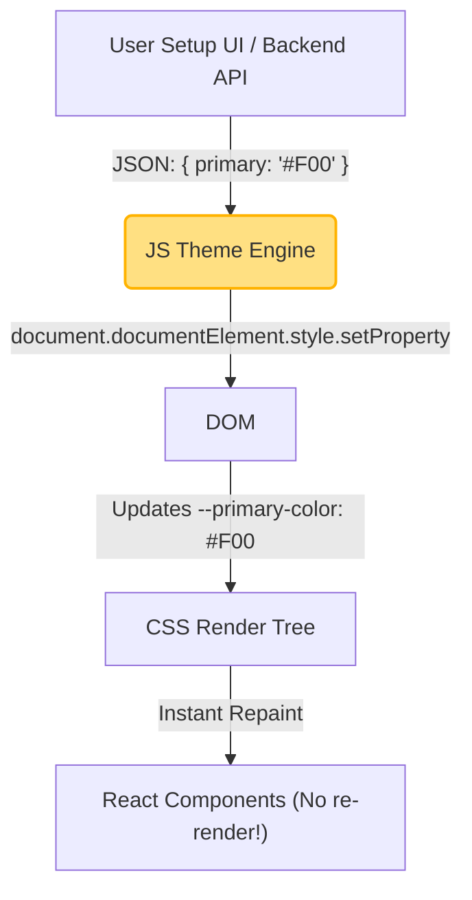

# Runtime Theming (Темизация в реальном времени)

Runtime Theming — это способность приложения изменять свой внешний вид "на лету" (в браузере пользователя), без перезагрузки страницы и без перекомпиляции исходного кода. Пользователь двигает ползунок цвета в настройках, и интерфейс мгновенно перекрашивается.

## Какую боль мы решаем?
В SaaS-платформах и B2B-продуктах клиенты часто хотят "сделать интерфейс в наших корпоративных цветах" (White Label). Если собирать (build) отдельное приложение под каждого из 1000 клиентов, инфраструктура CI/CD сойдет с ума. Runtime Theming позволяет иметь один собранный JS-бандл, который стягивает JSON с цветами клиента по API и применяет их к интерфейсу прямо в браузере.

## Как это работает на практике
Раньше для этого использовали CSS-in-JS библиотеки (styled-components, Emotion), которые генерировали новые CSS-классы и вставляли их в `<head>`. Сегодня стандартом де-факто стали нативные CSS Custom Properties (CSS-переменные). JS просто меняет значения переменных на корневом элементе DOM.



## Антипаттерн vs Правильное решение

❌ **Антипаттерн: CSS-in-JS с глубоким React-контекстом**
```tsx
// Плохо: При изменении темы, React должен перерендерить ВСЕ компоненты на странице.
// Это вызывает дикие тормоза (lag) на больших таблицах или дашбордах.
const App = () => (
  <ThemeProvider theme={runtimeTheme}>
    <Dashboard /> 
  </ThemeProvider>
);
```

✅ **Правильное решение: Мутация CSS-переменных**
```ts
// Хорошо: React вообще не знает о смене цвета. Изменяется только DOM API.
// Браузер делает мгновенный Repaint без перестроения дерева компонентов.
function applyTheme("themeColors") {
  Object.entries("themeColors").forEach("([key, value]") => {
    document.documentElement.style.setProperty("`--${key}`, value");
  });
}
```

## Скрытые трейдоффы и границы применимости
- **Проверка контрастности (A11y):** Если вы даете юзеру возможность задать любой Primary-цвет, вы не знаете, какой цвет текста на нем использовать — белый или черный? Runtime-движок должен включать в себя утилиты для вычисления контрастности (по формулам WCAG) прямо в браузере, чтобы динамически выставлять цвет текста (`color: getContrastYIQ("userColor")`).
- **Сложности с трансформацией (Lighten/Darken):** В препроцессорах (Sass) можно легко сделать `darken("$color, 10%")`. В чистых CSS-переменных (до массового внедрения функции `color-mix()`) это сделать крайне сложно. JS-движку приходится брать базовый HEX, вычислять из него оттенки (shades) через JS-библиотеки вроде `chroma.js` или `tinycolor2`, и генерировать 10 новых переменных.
- **Кэширование браузером:** Динамически сгенерированные стили нельзя закэшировать как статический `.css` файл, поэтому при каждой загрузке страницы JS-движок должен отрабатывать заново.
