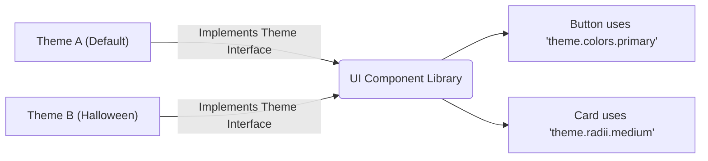

# Theming (Темизация)

Темизация в контексте UI-архитектуры — это механизм отделения визуального представления (цвета, шрифты, радиусы скругления) от структуры и бизнес-логики компонентов. Тема — это словарь (набор токенов), который "надевается" на каркас приложения.

## Какую боль мы решаем?
Жесткая связность (Tight Coupling). Если стили захардкожены внутри компонентов, любое изменение корпоративного стиля (ребрендинг) превращается в многомесячный рефакторинг с поиском `hex`-кодов по всему проекту. Грамотная темизация позволяет изменить внешний вид всего приложения (от кнопок до графиков) за считанные минуты, просто подменив один конфигурационный файл.

## Как это работает на практике
Тема проектируется как абстрактный интерфейс (в терминах TypeScript или JSON-схемы). Компоненты UI-библиотеки зависят не от конкретных значений, а от ключей этого интерфейса.



## Антипаттерн vs Правильное решение

❌ **Антипаттерн: "Плоская" тема без семантики**
```json
// Плохо: Разработчик компонента не понимает, какой цвет для чего использовать.
{
  "colors": {
    "blue": "#0000FF",
    "lightBlue": "#ADD8E6",
    "gray": "#CCCCCC"
  }
}
```

✅ **Правильное решение: Семантическая тема**
```json
// Хорошо: Цвета имеют смысл в контексте интерфейса (Intent).
{
  "colors": {
    "primary": "#0000FF",      // Для главных кнопок и акцентов
    "background": "#FFFFFF",   // Фон страниц
    "text": {
      "main": "#333333",
      "muted": "#CCCCCC"       // Для плейсхолдеров и подписей
    }
  }
}
```

## Неочевидные нюансы и границы применимости
- **Иллюзия всесильности:** Темизация отлично решает проблему "перекраски". Но если новый дизайн требует изменить *структуру* компонента (например, переместить иконку из правой части кнопки в левую или изменить поведение аккордеона), тема здесь бессильна. Тема управляет стилем, но не Layout'ом и не поведением.
- **Чрезмерная гранулярность (Over-engineering):** Попытка вынести в тему *вообще всё* (вплоть до `z-index` каждого дропдауна или длительности анимации в миллисекундах) приводит к тому, что файл темы весит сотни килобайт и его невозможно поддерживать. Дизайн-система должна иметь "жестко зашитые" базовые принципы, которые тема не может сломать.
- **Типизация тем (TypeScript):** Если тема не строго типизирована, разработчики будут делать опечатки (`theme.color.primry`). В современных библиотеках (например, MUI или styled-components) требуется сложное расширение типов (Declaration Merging), чтобы автокомплит в IDE понимал структуру вашей кастомной темы.
