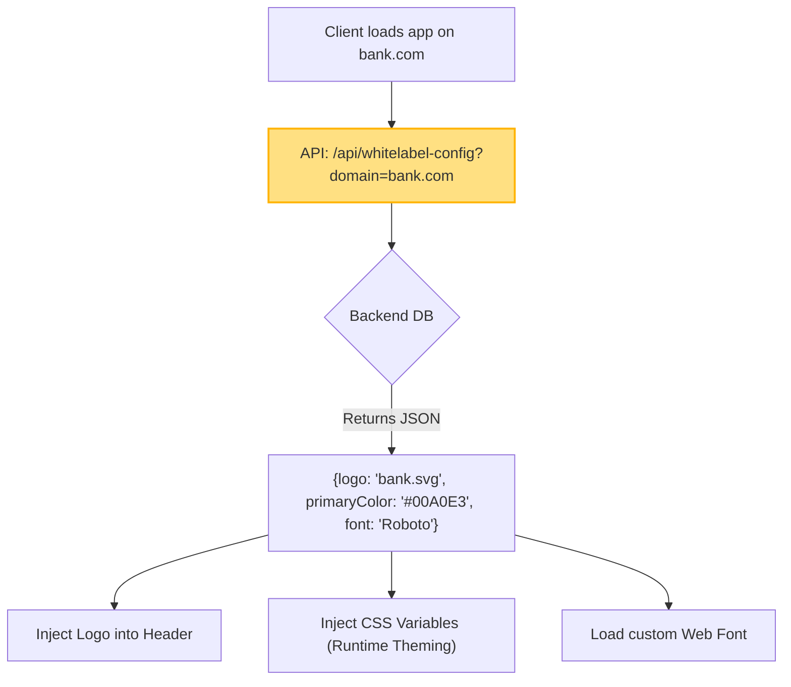

# White Label (Система "белой этикетки")

White Label в разработке интерфейсов — это модель построения продукта (часто SaaS), при которой приложение создается без собственного узнаваемого брендинга (нейтральным). Продукт продается компаниям-клиентам, которые "наклеивают на него свою этикетку": загружают свой логотип, задают свои корпоративные цвета, шрифты и иногда даже домен, после чего отдают это своим конечным пользователям как собственное приложение.

## Какую боль мы решаем?
Без White Label архитектуры компания-разработчик вынуждена форкать (копировать) репозиторий проекта для каждого крупного клиента (B2B), чтобы удовлетворить их требования к визуалу ("Сделайте нам зеленый хэдер"). Это порождает сотни копий кода (legacy hell). White Label позволяет поддерживать единую кодовую базу (Single Source of Truth), где кастомизация вынесена на уровень конфигов (базы данных), а не на уровень исходного кода.

## Как это работает на практике
При старте приложения фронтенд делает запрос к конфигурационному API (узнавая клиента по домену или токену авторизации). В ответ приходит JSON с бренд-конфигом. Эти данные маппятся на CSS-переменные или передаются в ThemeProvider.



## Антипаттерн vs Правильное решение

❌ **Антипаттерн: Жестко зашитые бренды в коде**
```tsx
// Плохо: Приложение знает о клиентах. Каждый новый клиент требует релиза фронтенда.
const getLogo = (clientId) => {
  if (clientId === 'gazprom') return <GazpromLogo />;
  if (clientId === 'sber') return <SberLogo />;
  return <DefaultLogo />;
};
```

✅ **Правильное решение: Динамическая подгрузка ресурсов (Data-Driven)**
```tsx
// Хорошо: Приложение "глупое". Новый клиент добавляется просто записью в БД менеджером.
const Header = ({ config }) => (
  <header style={{ backgroundColor: config.primaryColor }}>
    
  </header>
);
```

## Неочевидные нюансы и границы применимости
- **Предел кастомизации:** Клиенты всегда хотят большего. Сегодня они просят изменить цвета, завтра — "подвинуть эту кнопку вправо", а послезавтра — "добавить шаг с проверкой паспорта только для нас". Как только White Label выходит за рамки визуальной темизации (Токены) и требует изменения логики (Features), архитектура начинает ломаться, обрастая "костылями" (`if (client === 'A') { renderStep2() }`). Решение — Feature Toggles и плагинная архитектура, но это сильно усложняет код.
- **Ограничения App Store:** Apple и Google очень не любят White Label приложения (когда одна компания публикует 50 одинаковых приложений, отличающихся только цветом и логотипом) и могут забанить аккаунт разработчика по правилу "Spam". Поэтому на мобилках часто приходится делать одно общее приложение, где клиент выбирает свою компанию при авторизации.
- **Производительность:** Динамическая подгрузка шрифтов и стилей клиента замедляет First Contentful Paint (FCP). Приходится изощряться с SSR (Server-Side Rendering) и кэшированием на уровне CDN (Edge Functions), чтобы отдавать уже "раскрашенный" HTML при первом запросе.
