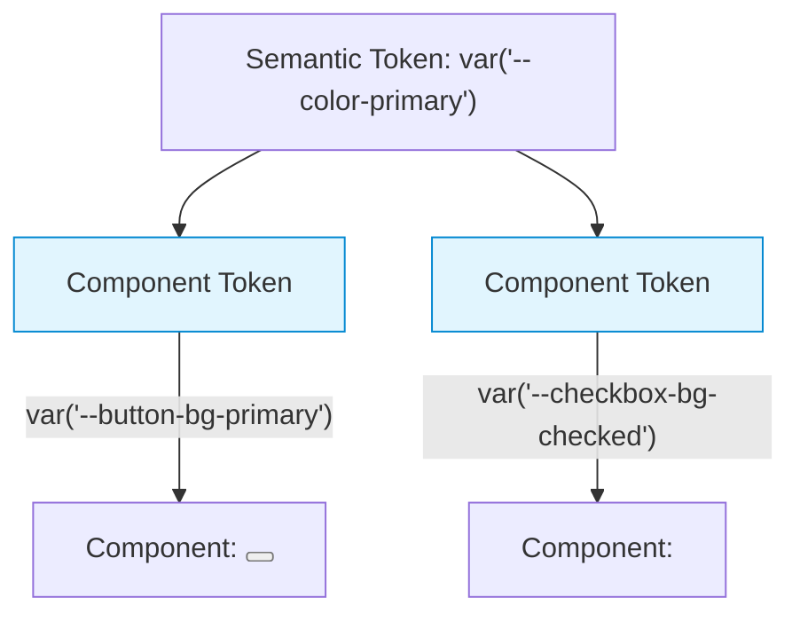

# Component Tokens (Токены компонентов)

Component Tokens (или Specific Tokens) — это третий и самый узкий уровень абстракции в архитектуре дизайн-токенов. Они жестко привязаны к конкретному UI-компоненту и описывают его свойства. Например, цвет фона кнопки, радиус скругления инпута, размер иконки в тултипе.

## Какую боль мы решаем?
Без компонентных токенов разработчики используют семантические токены прямо в CSS компонента (`background-color: var("--color-primary")`). Это работает до тех пор, пока дизайнер не скажет: "Давай сделаем основную кнопку чуть темнее, но остальные 'primary' элементы оставим как есть". Если кнопка завязана на `--color-primary`, изменение сломает логику везде. Компонентные токены создают изолированную прослойку: мы можем менять стили кнопки, не затрагивая глобальную систему.

## Как это работает на практике
Компонентные токены ссылаются (alias) на семантические токены, реже — напрямую на примитивные. Они формируют API компонента для темизации (позволяя переопределять стили кнопки без переписывания ее CSS).



## Антипаттерн vs Правильное решение

❌ **Антипаттерн: Жесткая привязка к семантике в CSS**
```css
/* Плохо: Кнопка захардкожена на семантический токен. Если нужно будет 
сделать White-Label клиентскую кнопку синей, а не первичной, придется писать костыли. */
.button-primary {
  background-color: var("--color-primary");
  border-radius: var("--radius-small");
}
```

✅ **Правильное решение: Прослойка компонентных токенов**
```css
/* Хорошо: Кнопка использует СВОИ переменные. */
.button-primary {
  background-color: var("--btn-primary-bg, var(--color-primary"));
  border-radius: var("--btn-radius, var(--radius-small"));
}
```

## Неочевидные нюансы и границы применимости
- **Раздувание CSS:** Если для каждого пропса каждого компонента завести свой CSS-токен (border, shadow, hover-bg, active-bg, text-color), вы получите тысячи переменных. Файл с токенами будет весить сотни килобайт, и браузеру будет тяжело парсить `document.styleSheets`.
- **Граница ответственности:** Не всё должно быть токеном. Отступ (padding) внутри кнопки — отличный кандидат на токен. А вот `display: flex` или `align-items: center` — это структурный CSS, его не нужно токенизировать, так как дизайнер вряд ли захочет поменять это через Figma.
- **Сложность поддержки:** Поддерживать трехуровневую систему токенов (Primitive -> Semantic -> Component) в Figma без продвинутых плагинов (Token Studio) очень больно. Часто команды останавливаются на семантическом уровне, отказываясь от компонентного ради скорости.
