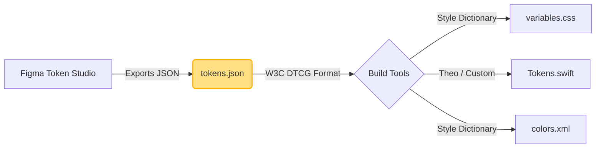

# Design Token Formats

Дизайн-токены должны где-то храниться. И поскольку они являются единым источником правды (SSOT) для дизайнеров (Figma/Sketch) и разработчиков (Web, iOS, Android), формат их хранения должен быть платформонезависимым. Нельзя хранить токены в `.css` или `.swift` файлах. Обычно для этого используются JSON или YAML.

## Какую боль мы решаем?
Раньше дизайнеры отдавали разработчикам PDF-гайдлайны или ссылку на Zeplin, а фронтендер переписывал значения руками в Sass-переменные. Если появлялось iOS-приложение, iOS-разработчик переписывал те же значения к себе. При обновлении цвета приходилось править три разные кодовые базы. Формат токенов отвязывает данные от языка программирования: мы храним данные в "сыром" виде, а скрипты генерируют код для нужной платформы.

## Как это работает на практике
Индустрия движется к стандартизации. W3C Design Tokens Community Group (DTCG) разрабатывает единый формат спецификации на базе JSON. В нем описывается не только значение (value), но и тип токена (color, dimension), чтобы генераторы кода знали, как его трансформировать.



## Антипаттерн vs Правильное решение

❌ **Антипаттерн: Хранение токенов в CSS/SCSS как SSOT**
```scss
// Плохо: iOS и Android разработчики не смогут прочитать и использовать этот файл.
$brand-color: #ff0000;
$spacing-md: 16px;
```

✅ **Правильное решение: Платформонезависимый JSON**
```json
// Хорошо: Понятно всем скриптам парсинга, строго типизировано.
{
  "brand": {
    "color": {
      "$value": "#ff0000",
      "$type": "color"
    }
  },
  "spacing": {
    "md": {
      "$value": "16",
      "$type": "dimension"
    }
  }
}
```

## Скрытые трейдоффы и границы применимости
- **Многословность JSON:** Чистый JSON не поддерживает комментарии и ссылки друг на друга (alias) из коробки. Различные инструменты (Style Dictionary) внедряют свой синтаксис (например, `"{colors.brand.value}"`), что делает JSON-файл невалидным для других тулзов, пока не утвердится финальный драфт W3C стандарта.
- **Человекочитаемость:** Разработчикам больно читать и править огромные вложенные JSON-файлы руками на 5000 строк. Поэтому токены должны экспортироваться автоматически из Figma, ручная правка JSON-токенов в репозитории — признак сломанного процесса D2C.
- **Математика в токенах:** Часто токен описывается математически (например, "line-height это font-size * 1.5"). JSON не умеет выполнять выражения. Эту логику приходится переносить на уровень инструментов трансформации (Token Transformations), что усложняет пайплайн.
