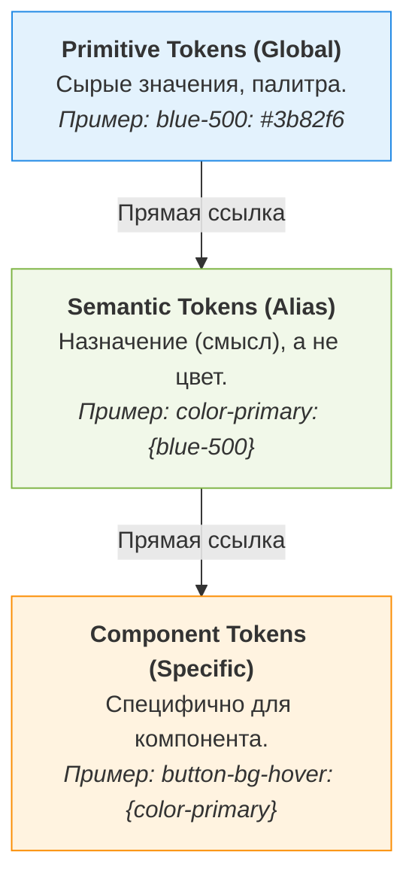

# Design Tokens (Дизайн-токены)

Дизайн-токены (Design Tokens) — это мельчайшие строительные блоки дизайн-системы. Они заменяют жестко зашитые значения (например, `#FF0000` или `14px`) на понятные, семантические имена (например, `color.error.main` или `spacing.medium`).

## 1. Какую боль мы решаем?

В традиционной разработке без токенов изменения дизайна превращаются в кошмар.
*   **Сложность ребрендинга:** Если маркетинг решает изменить фирменный синий цвет, разработчикам приходится делать "Поиск и Замену" по сотням файлов CSS/JS.
*   **Трудности с Dark Mode:** Без токенов поддержка светлой и темной тем требует дублирования всего CSS-кода или написания сложной логики.
*   **Отсутствие синхронизации:** Дизайнер в Figma изменил скругление углов с `4px` на `6px`. Разработчик об этом даже не узнает, пока не проверит каждый макет вручную.

Токены создают единый язык для дизайна и кода, позволяя автоматизировать эти процессы.

## 2. Архитектура и уровни абстракции

Токены обычно делятся на три уровня (Tiers), чтобы обеспечить максимальную гибкость и семантику:



1.  **Примитивные токены (Global/Primitive):** Независимы от контекста. Описывают всё, что есть в бренде (все оттенки цветов, все размеры шрифтов).
2.  **Семантические токены (Semantic):** Придают смысл примитивам. Отвечают на вопрос "Для чего это используется?".
3.  **Компонентные токены (Component):** Опциональный слой. Управляют стилизацией конкретных компонентов (кнопки, инпута).

## 3. Практический пример: Как это работает в коде

**Антипаттерн (Захардкоженные значения):**
```css
/* Кнопка сильно зависит от конкретного HEX. 
   Добавить темную тему будет сложно. */
.btn-primary {
  background-color: #3b82f6; /* blue-500 */
  color: #ffffff;
  padding: 8px 16px;
}
```

**Как надо (С использованием токенов):**

1. Сначала мы генерируем токены из Figma (например, через Style Dictionary) в CSS-переменные:
```css
:root {
  /* Primitive */
  --blue-500: #3b82f6;
  --white: #ffffff;
  
  /* Semantic (Светлая тема) */
  --color-primary: var(--blue-500);
  --text-on-primary: var(--white);
  --spacing-md: 16px;
}

[data-theme="dark"] {
  /* Semantic (Темная тема - меняем только семантику!) */
  --color-primary: var(--blue-300); /* Светлее для контраста */
}
```

2. И используем их в компонентах:
```css
.btn-primary {
  background-color: var(--color-primary);
  color: var(--text-on-primary);
  padding: calc(var(--spacing-md) / 2) var(--spacing-md);
}
```

## 4. Специфика, трейдоффы и границы применимости

### 4.1. Оверхед на Component Tokens
Многие команды пытаются создать токены для **каждого** свойства **каждого** компонента (например, `--button-primary-hover-border-color`). 
*   **Трейдофф:** Это дает максимальный контроль из Figma, но раздувает CSS-файлы до гигантских размеров и замедляет работу браузера.
*   **Решение:** Останавливайтесь на семантических токенах (Tier 2), пока не докажете бизнесу, что вам действительно нужны компонентные токены (Tier 3) (например, для White-label решений, где каждый клиент настраивает вид кнопок).

### 4.2. Именование (Naming Convention)
Самая сложная часть дизайн-токенов — это их названия. Если назвать токен `--color-red`, то когда дизайнер решит, что ошибки теперь оранжевые, вам придется переименовывать токен везде, или мириться с тем, что `color-red` выдает оранжевый цвет.
**Правило:** Называйте токены по их **функции**, а не по их **внешнему виду** (`--color-error`, а не `--color-red`).

### 4.3. Когда токены НЕ нужны
*   Простые лендинги без темной темы.
*   Проекты с жестко зафиксированным дизайном, который никогда не меняется.
*   Если вы используете Tailwind CSS "из коробки" и вас полностью устраивает его дефолтная палитра (в этом случае Tailwind сам выступает как ваша примитивная система токенов).