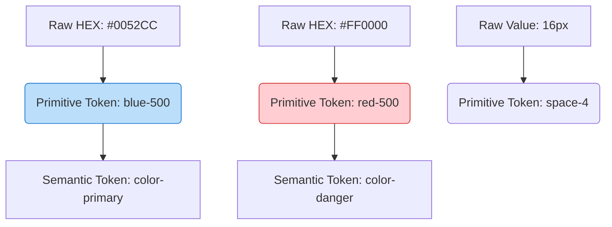

# Primitive Tokens (Базовые/Глобальные токены)

Primitive Tokens (иногда их называют Global Tokens, Core Tokens или Base Tokens) — это первый, самый низкий уровень абстракции дизайн-системы. Они представляют собой абсолютные, захардкоженные значения (сырые данные): HEX-коды цветов, значения в пикселях (px, rem), миллисекунды.

## Какую боль мы решаем?
Представьте, что у вас в коде 50 раз встречается цвет `#0052CC`. Вы можете просто использовать его как есть. Но если дизайнер решит поменять этот оттенок синего на `#0063EB`, вам придется искать `#0052CC` по всему коду. Primitive Tokens дают человекочитаемое имя каждому сырому значению. Это фундамент, из которого строятся все остальные токены.

## Как это работает на практике
Примитивные токены не несут контекста (семантики) использования. Токен называется `blue-500`, а не `button-color`. Это просто переменная, хранящая значение. Сами по себе примитивные токены **никогда не должны использоваться напрямую в компонентах** (это нарушает абстракцию).



## Антипаттерн vs Правильное решение

❌ **Антипаттерн: Использование примитивных токенов в UI-компонентах**
```css
/* Плохо: Компонент завязан на конкретный цвет. В темной теме кнопка останется синей, 
а не станет, например, белой, так как blue-500 — это всегда синий. */
.button {
  background-color: var(--blue-500);
}
```

✅ **Правильное решение: Использование их только для алиасинга**
```css
/* Хорошо: Примитивы живут в изоляции, компоненты используют семантику */
:root {
  --blue-500: #0052CC; /* Primitive */
  --color-primary: var(--blue-500); /* Semantic */
}

.button {
  background-color: var(--color-primary);
}
```

## Неочевидные нюансы и границы применимости
- **Как назвать цвета?** Это классическая проблема. Называть токены `blue-light`, `blue-dark`, `blue-darker` — тупиковый путь, так как оттенков может быть 10. Стандарт индустрии (Tailwind, Material) — использовать числовые шкалы от 50 до 900 (где 50 — самый светлый, 900 — самый темный, а 500 — базовый).
- **Мертвые токены:** Дизайнеры часто генерируют шкалу из 10 оттенков серого (от `gray-50` до `gray-900`), но в реальном интерфейсе используются только 3 из них. Остальные "мертвым грузом" висят в CSS-переменных.
- **Ограниченность контекста:** Значение `16px` может быть использовано для отступов (`space-16`) и для шрифта (`font-size-16`). Нельзя создавать один примитивный токен `size-16` и использовать его и там, и там. Токены шрифтов и отступов должны лежать в разных шкалах, так как они масштабируются по разным законам.
