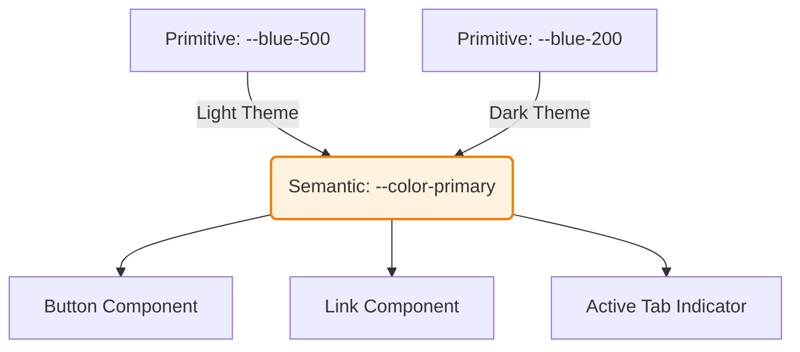

# Semantic Tokens (Семантические токены)

Semantic Tokens (иногда Alias Tokens или Purpose Tokens) — это второй уровень архитектуры токенов. Если Примитивные токены отвечают на вопрос *"Как это выглядит?"* (синий цвет), то Семантические токены отвечают на вопрос *"Зачем это нужно?"* (основной цвет действия, цвет ошибки). Они связывают сырое значение с бизнес-смыслом (семантикой).

## Какую боль мы решаем?
Когда продукт начинает поддерживать Темную тему (Dark Mode) или несколько брендов (White Label), примитивные токены ломаются. Вы не можете сказать кнопке "Будь синей" (`--blue-500`), потому что в темной теме она должна быть белой, а для другого бренда — зеленой. Семантические токены позволяют отвязать компонент от реального цвета. Кнопка говорит: "Я — первичное действие (`--color-primary`)", а как это выглядит — решает текущая тема.

## Как это работает на практике
Семантические токены всегда ссылаются (alias) на примитивные. Вся логика переключения тем (Theming) строится на подмене того, на какой примитив ссылается семантический токен.



## Антипаттерн vs Правильное решение

❌ **Антипаттерн: Семантика, завязанная на визуал (Слабая семантика)**
```css
/* Плохо: Имя токена всё еще диктует его внешний вид. Если текст-предупреждение
в новом дизайне станет оранжевым, имя --text-yellow потеряет смысл. */
:root {
  --text-yellow: var(--yellow-500);
}
```

✅ **Правильное решение: Чистая семантика намерения (Intent)**
```css
/* Хорошо: Имя описывает назначение. Цвет может быть любым. */
:root {
  --text-warning: var(--yellow-500);
}
[data-theme="dark"] {
  --text-warning: var(--orange-300); /* Тема меняет примитив, но не семантику */
}
```

## Неочевидные нюансы и границы применимости
- **Сколько семантики нужно?** Можно сделать 5 токенов (`primary`, `secondary`, `danger`, `success`, `warning`), а можно 500 (`text-primary`, `bg-primary`, `border-primary`, `icon-primary`). Чем выше гранулярность, тем гибче темизация (можно сделать фон синим, а бордер оставить серым), но тем сложнее дизайнерам и разработчикам запомнить, какой токен где использовать.
- **Риск дублирования:** Разработчики могут создать токен `--header-bg` и `--footer-bg`, которые оба ссылаются на `--gray-100`. Если таких токенов станет слишком много, система перейдет на уровень Компонентных токенов (Component Tokens), что сильно усложнит поддержку словаря.
- **Ограниченность математики:** Если в светлой теме `text-secondary` — это просто серый цвет, то в темной теме дизайнер может захотеть сделать его белым цветом с opacity 60% (`rgba(255,255,255,0.6)`). Семантический токен цвета должен поддерживать прозрачность, что усложняет генерацию CSS (приходится использовать HSL или разбивать HEX на каналы).
