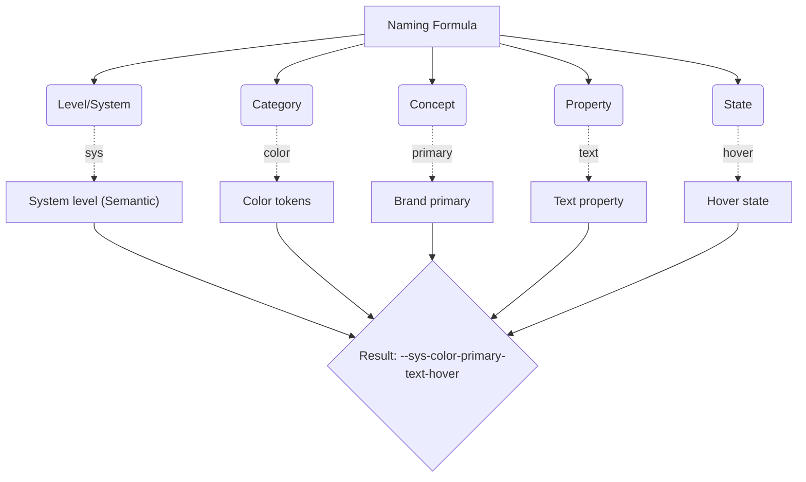

# Token Naming (Именование токенов)

Токены — это язык общения между дизайнерами и разработчиками. Если этот язык не имеет четкой грамматики (правил именования), он превращается в тарабарщину. Соглашение об именовании токенов — это строгий синтаксис, определяющий, как должно формироваться имя переменной, чтобы оно было предсказуемым, масштабируемым и легко находилось автокомплитом в IDE.

## Какую боль мы решаем?
Без строгих правил в системе появляются переменные вроде `--bg-blue`, `--mainText`, `--ButtonColor` и `--dark-gray`. Разработчик не понимает:
1. К какому уровню абстракции относится токен (примитив или семантика)?
2. Где его можно использовать (это цвет текста или цвет фона)?
3. В каком он формате (camelCase, kebab-case)?
Строгая таксономия исключает когнитивную нагрузку при выборе токена.

## Как это работает на практике
В индустрии прижилась методология **CTI (Category, Type, Item)**, которую популяризировал фреймворк Style Dictionary, или ее расширенная версия (System -> Category -> Concept -> Property -> Variant).

Структура обычно выглядит так:
`[Уровень] - [Категория] - [Свойство] - [Концепт/Семантика] - [Состояние/Вариант]`



## Антипаттерн vs Правильное решение

❌ **Антипаттерн: Хаотичное, описывающее внешний вид именование**
```css
/* Плохо: Названия не структурированы, нет понимания, где их применять */
:root {
  --grey-text: #333;
  --bg-for-card: #fff;
  --error-color: red;
}
```

✅ **Правильное решение: Строгая таксономия (Например, по Material Design 3)**
```css
/* Хорошо: Сначала уровень абстракции (md), потом категория (ref/sys), потом тип, затем роль */
:root {
  --md-ref-palette-primary-50: #e3f2fd; /* Примитив */
  --md-sys-color-primary: var("--md-ref-palette-primary-500"); /* Семантика */
  --md-comp-button-container-color: var("--md-sys-color-primary"); /* Компонентный */
}
```

## Неочевидные нюансы и границы применимости
- **Разные платформы — разные кейсы:** Web использует `kebab-case` (CSS variables), iOS — `camelCase` (Swift), Android — `snake_case` (XML). Именование в JSON-токенах должно быть структурированным деревом, а конвертация в нужный регистр должна ложиться на инструменты сборки (Style Dictionary).
- **Длинные имена:** Строгая таксономия приводит к огромным именам (например, `--color-background-interactive-destructive-hover`). Это выглядит пугающе в коде, но это необходимый трейдофф за предсказуемость.
- **Ограниченность автокомплита:** Если токен называется `--text-primary-color`, разработчику сложнее найти все цвета. Если `--color-text-primary`, то набрав `--color-` он увидит все цвета системы. Порядок слов (от общего к частному) критически важен для Developer Experience (DX).
