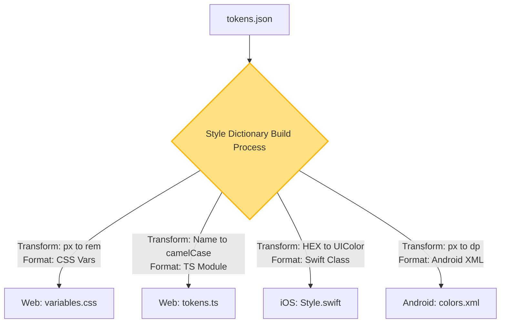

# Token Transformations (Трансформация токенов)

Если дизайн-токены хранятся в платформонезависимом JSON, их невозможно использовать в коде "как есть". Браузер не понимает JSON в CSS-стилях, а iOS не понимает CSS-переменные. Token Transformations — это этап сборки (Build pipeline), на котором сырые данные конвертируются (трансформируются и форматируются) в платформо-специфичный код.

## Какую боль мы решаем?
Без автоматической трансформации вам придется вручную парсить JSON для Web, вручную писать скрипты для генерации Swift-классов для iOS и XML для Android. Вы столкнетесь с тем, что в Web тень описывается как `0px 4px 10px rgba(0,0,0,0.1)`, а в iOS тень описывается отдельными свойствами (radius, offset, opacity). Трансформатор (например, Amazon Style Dictionary или Theo) берет на себя эту грязную работу.

## Как это работает на практике
Пайплайн состоит из двух шагов:
1. **Transforms (Трансформации значений):** Конвертация `16px` в `1rem` для веба, или в `16dp` для Android. Конвертация цвета из HEX (`#ff0000`) в `UIColor(red: 1.0, green: 0.0, ...)` для iOS.
2. **Formats (Форматирование файлов):** Обертка трансформированных значений в нужный синтаксис. Для веба это `:root { ... }` (CSS), для TS это `export const tokens = { ... }`.



## Антипаттерн vs Правильное решение

❌ **Антипаттерн: Самописные JS-скрипты на коленке**
```js
// Плохо: Скрипт не умеет резолвить алиасы, падает на ошибках и жестко привязан к вебу.
const fs = require('fs');
const tokens = require('./tokens.json');
const css = Object.entries(tokens).map(([k, v]) => `--${k}: ${v};`).join('\n');
fs.writeFileSync('tokens.css', `:root { ${css} }`);
```

✅ **Правильное решение: Использование Style Dictionary**
```js
// Хорошо: Индустриальный стандарт от Amazon, умеет раскрывать ссылки {colors.primary} 
// и имеет готовые пресеты для всех платформ.
const StyleDictionary = require('style-dictionary').extend('config.json');
StyleDictionary.buildAllPlatforms();
```

## Неочевидные нюансы и границы применимости
- **Разрешение ссылок (Alias Resolution):** В JSON семантический токен ссылается на примитив: `"primary": "{colors.blue.500}"`. На этапе сборки трансформатор должен найти `colors.blue.500`, подставить его значение и только потом сгенерировать CSS. Если дизайнер зациклит ссылки (A ссылается на B, B на A), сборка упадет с переполнением стека.
- **Математика:** Если дизайнер задает в Figma `line-height: 150%`, для веба это трансформируется в `1.5`, для iOS — в вычисление `fontSize * 1.5`, а для Android вообще может не поддерживаться напрямую в токенах. Трансформаторы вынуждены писать сложные костыльные плагины для таких свойств.
- **Typography & Shadows:** Это "составные" токены. Тень состоит из X, Y, Blur, Spread и Color. В Figma это один объект, а в CSS — строка. Трансформатор должен уметь склеивать объекты в строку для Web и разбирать на части для мобилок.
