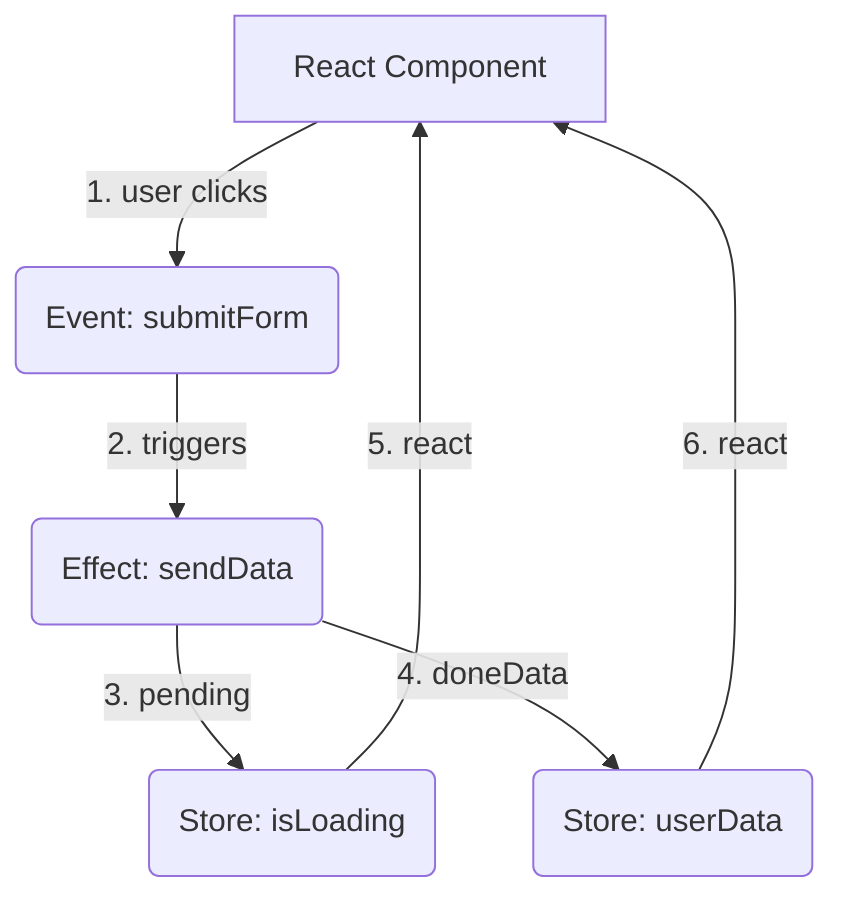

# Effector

## Инженерная история: Реактивность без боли и бойлерплейта

В мире фронтенда долгое время доминировал подход, где бизнес-логика была неразрывно связана с UI. Мы писали гигантские редьюсеры в Redux или размазывали логику по `useEffect` в компонентах React. Effector появился как ответ на эту боль: он предлагает отделить бизнес-логику от представления, сделав её независимой, типизированной и предсказуемой.

Суть Effector заключается в трёх базовых примитивах: **Store** (состояние), **Event** (намерение/событие) и **Effect** (асинхронная операция, сайд-эффект). Магия происходит, когда мы связываем их вместе с помощью оператора `sample`, выстраивая направленный граф потока данных. Это позволяет тестировать логику вообще без UI-фреймворка.

## Как это работает на практике

Effector строит реактивный граф. Когда срабатывает событие, данные текут по графу, обновляя сторы и запуская эффекты только там, где это необходимо, без лишних ререндеров.



## Примеры кода

### ❌ Антипаттерн: Логика внутри компонента

Бизнес-логика смешивается с жизненным циклом компонента, её сложно переиспользовать и тестировать.

```javascript
// Плохо: хуки, сайд-эффекты и состояние перемешаны
function UserProfile({ userId }) {
  const [user, setUser] = useState(null);
  const [loading, setLoading] = useState(false);

  useEffect(() => {
    setLoading(true);
    fetch(`/api/users/${userId}`)
      .then(res => res.json())
      .then(data => {
        setUser(data);
        setLoading(false);
      });
  }, [userId]);

  if (loading) return <Spinner />;
  return <div>{user.name}</div>;
}
```

### ✅ Правильное решение: Декларативный граф Effector

Логика описывается отдельно и связывается через `sample`.

```javascript
import { createStore, createEvent, createEffect, sample } from 'effector';
import { useUnit } from 'effector-react';

// 1. Примитивы
export const fetchUserFx = createEffect(async (id) => {
  const res = await fetch(`/api/users/${id}`);
  return res.json();
});
export const userRequested = createEvent();
export const $user = createStore(null).on(fetchUserFx.doneData, (_, user) => user);

// 2. Связывание (Бизнес-логика)
sample({
  clock: userRequested,
  target: fetchUserFx,
});

// 3. UI
function UserProfile({ id }) {
  // Компонент только читает данные и триггерит события
  const [user, loading, request] = useUnit([$user, fetchUserFx.pending, userRequested]);
  
  useEffect(() => { request(id); }, [id]);

  if (loading) return <Spinner />;
  return <div>{user?.name}</div>;
}
```

## Неочевидные нюансы и границы применимости

- **Кривая обучения:** Effector требует сдвига парадигмы. Мыслить потоками данных и оператором `sample` поначалу непривычно, особенно после императивного кода.
- **Оверхед на простых задачах:** Для простого CRUD-приложения или лендинга с парой форм Effector — это стрельба из пушки по воробьям.
- **Трейдофф дебаггинга:** Без специальных плагинов (например, `effector-logger` или интеграции с Redux DevTools) дебажить направленный граф событий может быть тяжело. Обязательно нужно использовать Babel/SWC плагин для автоматического именования юнитов.
- **Сфера применения:** Идеален для сложных enterprise-приложений со сложной логикой, где много взаимосвязанных состояний, веб-сокетов и фоновых процессов. В таких проектах архитектурная строгость Effector окупается сторицей.
