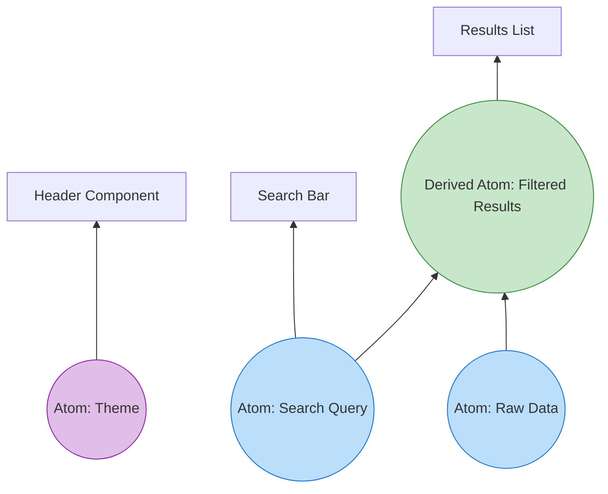

# Jotai

## Инженерная история: Атомарное состояние без боли

React Context — отличный инструмент для Dependency Injection, но ужасный для управления состоянием, которое часто меняется. Если вы положите объект с 10 полями в Context, изменение одного поля заставит перерендериться *все* компоненты, которые читают этот контекст, даже если им нужно только другое, неизменное поле. 

Jotai (в переводе с японского "состояние") решает эту боль через паттерн "атомов". Вы разбиваете глобальное состояние на крошечные, независимые кусочки (атомы). Компоненты подписываются только на те атомы, которые им действительно нужны. В итоге мы получаем хирургически точные ререндеры без сложных мемоизаций (`React.memo`, `useMemo`) и без тяжеловесного бойлерплейта Redux.

## Как это работает на практике

Jotai строит граф зависимостей снизу вверх. Вы объявляете примитивные атомы, а затем можете создавать производные атомы, которые читают или пишут в другие атомы.



## Примеры кода

### ❌ Антипаттерн: Монолитный Context

Каждое изменение ввода вызывает ререндер всего приложения, если оно завёрнуто в этот контекст без сложной оптимизации.

```javascript
const AppContext = createContext();

function AppProvider({ children }) {
  const [state, setState] = useState({ theme: 'light', search: '', items: [] });
  // Любое изменение state.search триггерит ререндер потребителей theme!
  return <AppContext.Provider value={{ state, setState }}>{children}</AppContext.Provider>;
}
```

### ✅ Правильное решение: Атомы Jotai

Просто, декларативно, и ререндерятся только те компоненты, чьи атомы изменились.

```javascript
import { atom, useAtom, useAtomValue } from 'jotai';

// 1. Определяем атомы (где угодно, хоть в другом файле)
export const searchAtom = atom('');
export const dataAtom = atom([{ id: 1, text: 'Apple' }, { id: 2, text: 'Banana' }]);

// 2. Производный атом (Derived State)
export const filteredDataAtom = atom((get) => {
  const filter = get(searchAtom).toLowerCase();
  const data = get(dataAtom);
  return data.filter(item => item.text.toLowerCase().includes(filter));
});

// 3. Использование в UI
function SearchInput() {
  const [search, setSearch] = useAtom(searchAtom);
  return <input value={search} onChange={e => setSearch(e.target.value)} />;
}

function Results() {
  // Этот компонент не знает о searchAtom, только о результате
  const results = useAtomValue(filteredDataAtom);
  return <ul>{results.map(r => <li key={r.id}>{r.text}</li>)}</ul>;
}
```

## Неочевидные нюансы и границы применимости

- **Утечки памяти при динамическом создании:** Атомы Jotai — это ссылки на объекты. Если создавать новые атомы внутри рендера компонента (например, в цикле или мапе) и не использовать `useMemo`, они будут пересоздаваться и никогда не соберутся сборщиком мусора, так как Jotai хранит их в WeakMap по ссылке.
- **Отсутствие строгой архитектуры:** В отличие от Effector или Redux, Jotai не диктует, *как* организовывать бизнес-логику. Вы можете легко размазать логику обновления атомов по десяткам компонентов, превратив кодовую базу в спагетти.
- **Трейдофф:** Идеален для высокоинтерактивных UI (редакторы, канвасы, игры), где нужно управлять сотнями мелких состояний (координаты мыши, выделенный элемент) с максимальной производительностью. Для приложений со сложными асинхронными бизнес-процессами лучше выбрать что-то более структурированное.
