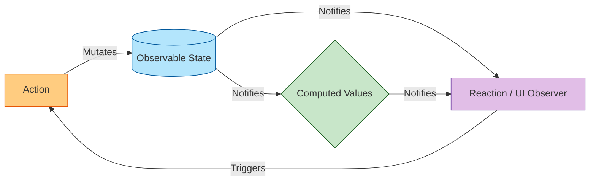

# MobX

## Инженерная история: Реактивность через мутации

В экосистеме React исторически укоренилась концепция иммутабельности: "чтобы React понял, что данные изменились, нужно создать новый объект". Это порождает огромный пласт бойлерплейта — спреды, глубокое клонирование, `reducer`-ы. MobX решает эту проблему радикально и элегантно, реализуя концепцию прозрачного функционального реактивного программирования (TFRP).

С MobX вы просто *мутируете* свойства объектов так, как делали бы это в ванильном JavaScript (`user.age++`), а интерфейс обновляется сам. Под капотом MobX использует ES6 Proxies для отслеживания того, какие именно свойства были прочитаны (read) компонентом во время рендера. Как только мутируется именно это свойство, MobX точечно заставляет перерендериться только тот компонент, который от него зависит.

## Как это работает на практике

Архитектура MobX строится на триаде: **State** (наблюдаемые данные), **Derivations/Computed** (вычисляемые значения на основе стейта) и **Reactions** (побочные эффекты, включая рендер UI).



## Примеры кода

### ❌ Антипаттерн: Иммутабельные страдания в сложном графе объектов

Обновление глубоко вложенного свойства без MobX требует ручного клонирования дерева, что медленно и многословно.

```javascript
const [store, setStore] = useState({
  user: { profile: { name: 'Alice', age: 25 }, settings: { theme: 'dark' } }
});

// Чтобы изменить возраст, пересоздаем весь путь
const birthday = () => {
  setStore(prev => ({
    ...prev,
    user: {
      ...prev.user,
      profile: { ...prev.user.profile, age: prev.user.profile.age + 1 }
    }
  }));
};
```

### ✅ Правильное решение: Магия MobX

Определяем класс (или объект) как наблюдаемый и просто мутируем его в `action`.

```javascript
import { makeAutoObservable } from "mobx";
import { observer } from "mobx-react-lite";

// 1. Модель данных (Store)
class UserStore {
  user = { profile: { name: 'Alice', age: 25 }, settings: { theme: 'dark' } };

  constructor() {
    makeAutoObservable(this); // Вся магия здесь
  }

  // 2. Экшен (мутация)
  birthday() {
    this.user.profile.age++;
  }
  
  // 3. Вычисляемое свойство (кэшируется)
  get isAdult() {
    return this.user.profile.age >= 18;
  }
}
const store = new UserStore();

// 4. UI: Оборачиваем в observer
const UserProfile = observer(({ store }) => {
  return (
    <div>
      <p>{store.user.profile.name} is {store.user.profile.age} years old.</p>
      <button onClick={() => store.birthday()}>Happy Birthday!</button>
    </div>
  );
});
```

## Неочевидные нюансы и границы применимости

- **Магия и непредсказуемость:** Поскольку MobX перехватывает чтения через прокси, деструктуризация объектов или раннее обращение к свойствам может сломать реактивность. Если вы передадите деструктурированное значение (`const { age } = store.user.profile`) дочернему компоненту, не обернутому в `observer`, он не обновится!
- **Трудности дебага:** Из-за того что стейт мутируется "где угодно", может быть очень сложно отследить, *какой именно* кусок кода инициировал мутацию, если вы не включили строгий режим (Strict Mode), запрещающий менять стейт вне экшенов.
- **Оверхед на прокси:** На огромных массивах данных (десятки тысяч элементов) оборачивание каждого объекта в Proxy может ударить по производительности и потреблению памяти.
- **Сфера применения:** MobX феноменально хорош для приложений со сложной, ООП-подобной доменной моделью на клиенте (например, табличные процессоры, сложные редакторы, CRM-системы со связями). Он позволяет писать чистый бизнес-код, почти не думая о том, что это фронтенд.
