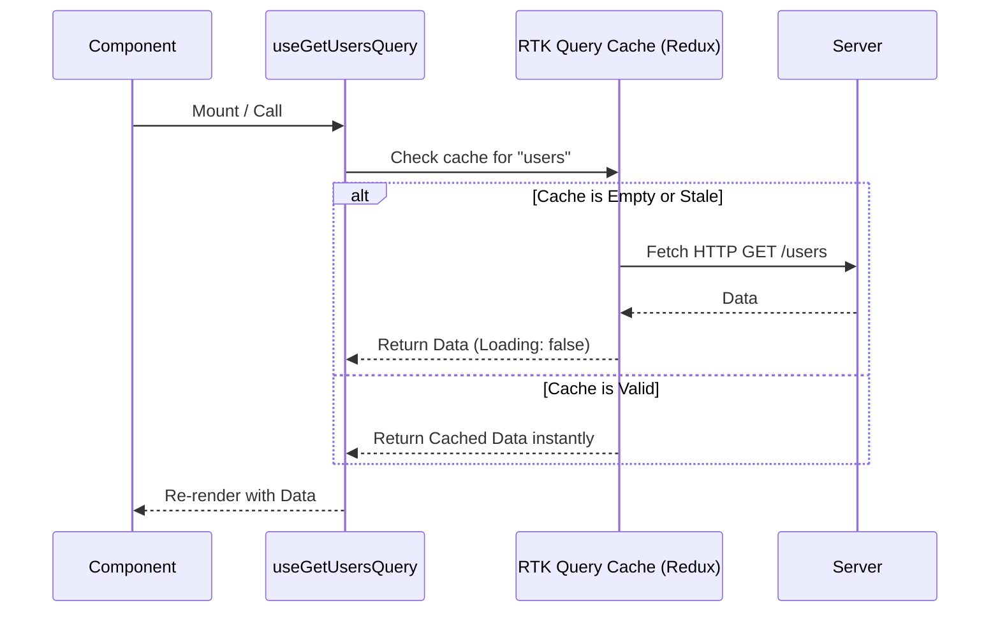

# RTK Query

## Инженерная история: Уничтожение бойлерплейта при работе с API

Исторически, при использовании Redux, запрос данных с сервера превращался в ритуал. Разработчику приходилось писать `ACTION_REQUEST`, `ACTION_SUCCESS`, `ACTION_FAILURE`, создавать селекторы, управлять флагами `isLoading` и `isError`, а затем ломать голову над тем, как кэшировать результаты и когда их инвалидировать. 

RTK Query (идет в коробке с Redux Toolkit) был создан, чтобы решить эту фундаментальную боль — управление **серверным состоянием** (Server State). Он абстрагирует весь процесс fetching'а, caching'а, синхронизации и обновления данных, предоставляя декларативный API на базе эндпоинтов и автоматически генерируя хуки для React.

## Как это работает на практике

Вы описываете "сервис" с эндпоинтами. RTK Query под капотом сам создает нужные редюсеры и middleware, сам ходит в сеть, кладет данные в store Redux по ключам, управляет временем жизни кэша и предоставляет удобные хуки для компонентов. Инвалидация кэша работает через систему тегов: мутация (POST/PUT) "инвалидирует" тег, что заставляет RTK Query автоматически перевызвать запросы (GET), которые этот тег "предоставляли".



## Примеры кода

### ❌ Антипаттерн: Ручной Redux-Thunk для каждого запроса

Горы кода просто для того, чтобы показать список пользователей и спиннер.

```javascript
// Нужно написать: thunk, reducer, state shape...
export const fetchUsers = createAsyncThunk('users/fetch', async () => {
  const response = await client.get('/users');
  return response.data;
});

// В компоненте:
const dispatch = useDispatch();
const { users, status } = useSelector(state => state.users);

useEffect(() => {
  dispatch(fetchUsers());
}, [dispatch]);

if (status === 'loading') return <Spinner />;
```

### ✅ Правильное решение: Декларативный API RTK Query

Описываем эндпоинт один раз, получаем автоматический кэш и типы.

```javascript
import { createApi, fetchBaseQuery } from '@reduxjs/toolkit/query/react';

// 1. Описание API
export const api = createApi({
  reducerPath: 'api',
  baseQuery: fetchBaseQuery({ baseUrl: '/api' }),
  tagTypes: ['User'], // Для инвалидации
  endpoints: (builder) => ({
    getUsers: builder.query({
      query: () => '/users',
      providesTags: ['User'], // Помечаем, что тут лежат юзеры
    }),
    addUser: builder.mutation({
      query: (body) => ({ url: '/users', method: 'POST', body }),
      invalidatesTags: ['User'], // При успешном POST старый список сбрасывается и перезапрашивается
    }),
  }),
});

// Автосгенерированные хуки!
export const { useGetUsersQuery, useAddUserMutation } = api;

// 2. В компоненте
function UserList() {
  const { data: users, isLoading, error } = useGetUsersQuery();
  
  if (isLoading) return <Spinner />;
  if (error) return <div>Error!</div>;
  return <ul>{users.map(u => <li key={u.id}>{u.name}</li>)}</ul>;
}
```

## Неочевидные нюансы и границы применимости

- **Привязка к Redux:** RTK Query не имеет смысла, если у вас в проекте нет Redux. Если вы стартуете новый проект без Redux, лучше взять TanStack Query (React Query) — он независим и легче.
- **Размер бандла:** Если вы уже используете Redux Toolkit, добавление RTK Query почти ничего не стоит. Но тащить весь Redux Toolkit *только* ради RTK Query — неоправданный оверхед.
- **Сложность инвалидации кэша:** В крупных проектах система тегов (`providesTags`, `invalidatesTags`) может превратиться в запутанный клубок. Если мутация затрагивает множество разных сущностей, правильно настроить инвалидацию бывает больно.
- **Ограниченная работа с нормализацией:** В отличие от Apollo или Relay, RTK Query хранит ответы по урлам/аргументам запроса, а не нормализует граф объектов. Если объект `User(id:1)` пришел в двух разных запросах, в кэше будет две копии. Обновление одной не обновит другую автоматически (нужно использовать pessimistic/optimistic updates и `api.util.updateQueryData`).
