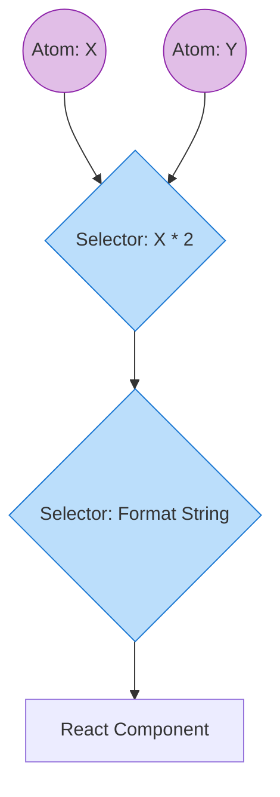

# Recoil

## Инженерная история: Граф производного состояния

Когда команда Facebook разрабатывала сложные графические инструменты (например, редакторы со множеством узлов, где изменение одного ползунка должно пересчитать свойства 50 других элементов), они столкнулись с проблемой. Redux с его единым деревом стейта не справлялся с перфомансом, а Context вызывал лишние ререндеры. Им нужен был инструмент, который поддерживает Concurrent Mode React и позволяет выстраивать сложный, динамический граф зависимостей. Так появился Recoil.

Суть Recoil сводится к двум примитивам: **Атомы** (кусочки независимого состояния) и **Селекторы** (чистые функции, которые вычисляют производное состояние на основе атомов или других селекторов). Recoil выстраивает направленный ациклический граф (DAG) от атомов к компонентам.

## Как это работает на практике

Когда компонент запрашивает данные из селектора, селектор смотрит на свои зависимости (атомы). Если атом меняется, селектор перевычисляется, и только компоненты, подписанные на этот селектор, перерендериваются.



## Примеры кода

### ❌ Антипаттерн: Сложные вычисления в рендере

Пересчет дорогой логики при каждом рендере из-за изменения несвязанного состояния.

```javascript
function CanvasEditor({ x, y }) {
  // Вычисляется при любом рендере компонента
  const expensiveResult = useMemo(() => calculatePhysics(x, y), [x, y]);
  return <div>{expensiveResult}</div>;
}
```

### ✅ Правильное решение: Селекторы Recoil

Логика выносится в селектор. Он кэширует результат и обновляется только если `x` или `y` реально изменились.

```javascript
import { atom, selector, useRecoilValue } from 'recoil';

export const xAtom = atom({ key: 'x', default: 0 });
export const yAtom = atom({ key: 'y', default: 0 });

export const physicsSelector = selector({
  key: 'physics',
  get: ({ get }) => {
    const x = get(xAtom);
    const y = get(yAtom);
    return calculatePhysics(x, y); // Вызовется только при изменении x или y
  },
});

function CanvasEditor() {
  const result = useRecoilValue(physicsSelector);
  return <div>{result}</div>;
}
```

## Неочевидные нюансы и границы применимости

- **Стагнация развития:** Библиотека фактически заброшена Meta. Развитие остановилось, новые фичи почти не выходят, в то время как конкуренты (Jotai, Zustand) активно развиваются. В новых проектах использовать Recoil рискованно.
- **Утечки памяти:** В ранних версиях (и отчасти до сих пор) динамическое создание атомов с уникальными ключами могло приводить к утечкам памяти, так как Recoil не всегда мог эффективно удалять неиспользуемые узлы графа.
- **Сфера применения:** Был идеален для приложений типа Figma, Miro или сложных дашбордов, где состояние состоит из тысяч независимых, но математически связанных узлов. Для классических "формошлепских" CRUD-приложений — избыточен.
