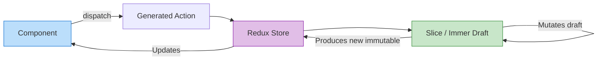

# Redux Toolkit (RTK)

## Инженерная история: Спасение экосистемы Redux

Ванильный Redux был гениален в своей простоте (одно дерево, чистые функции-редюсеры, экшены), но невыносим в использовании. Разработчики писали тысячи строк бойлерплейта: константы для типов экшенов, фабрики экшенов, огромные `switch/case` с ручным копированием глубоко вложенных объектов (`...state`). 

Redux Toolkit (RTK) — это официальный, современный стандарт написания Redux-логики. Он решает главную боль: устраняет бойлерплейт. Под капотом RTK использует библиотеку **Immer**, которая позволяет писать мутабельный код (например, `state.user.age++`), а затем автоматически превращает эти мутации в корректные иммутабельные обновления.

## Как это работает на практике

RTK вводит понятие `slice` (срез состояния). Один слайс автоматически генерирует и типы экшенов, и сами экшены, и редюсер.



## Примеры кода

### ❌ Антипаттерн: Ванильный Redux (Бойлерплейт)

То, от чего все хотели избавиться.

```javascript
const INCREMENT = 'counter/INCREMENT';
export const increment = () => ({ type: INCREMENT });

function counterReducer(state = { value: 0 }, action) {
  switch (action.type) {
    case INCREMENT:
      return { ...state, value: state.value + 1 };
    default:
      return state;
  }
}
```

### ✅ Правильное решение: RTK Slice

Весь этот код сокращается до нескольких строк с помощью `createSlice`.

```javascript
import { createSlice, configureStore } from '@reduxjs/toolkit';

const counterSlice = createSlice({
  name: 'counter',
  initialState: { value: 0 },
  reducers: {
    increment: (state) => {
      // Immer под капотом! Мы "мутируем" стейт напрямую,
      // но в реальности создается иммутабельная копия.
      state.value += 1; 
    },
  },
});

export const { increment } = counterSlice.actions;

export const store = configureStore({
  reducer: { counter: counterSlice.reducer },
});
```

## Неочевидные нюансы и границы применимости

- **Опасность Immer:** Так как Immer позволяет "мутировать" стейт, новички часто путаются, когда можно возвращать новый стейт из редюсера, а когда мутировать старый. Нельзя делать и то, и другое одновременно.
- **Единое дерево (Single Source of Truth):** RTK все еще сохраняет концепцию единого глобального объекта. При очень частых обновлениях (например, движение мыши 60 раз в секунду) это вызовет просадку производительности, так как пересчитывается всё дерево.
- **Границы применимости:** RTK — отличный выбор для средних и крупных корпоративных приложений, где важна предсказуемость, мощный дебаг (Time Travel Debugging в Redux DevTools) и единый стандарт кода для большой команды. Но для стартапов и простых проектов Zustand или Jotai подойдут лучше и сэкономят время.
