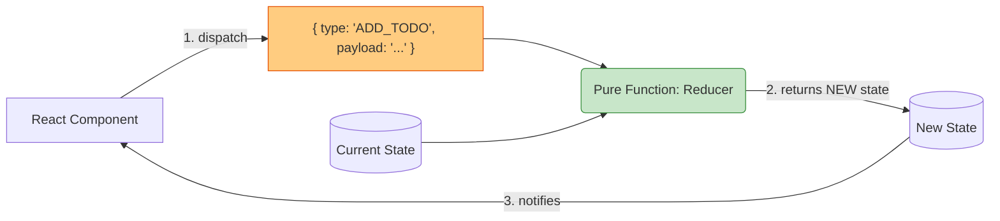

# Redux

## Инженерная история: Революция предсказуемости

До появления Redux фронтенд страдал от архитектуры MVC (Model-View-Controller) в реализации двустороннего связывания. Изменение модели обновляло вьюху, вьюха меняла другую модель, и возникал эффект домино: "каскадные обновления", при которых отследить источник бага было невозможно.

Redux, вдохновленный архитектурой Flux от Facebook и языком Elm, решил эту боль жестким ограничением: **однонаправленный поток данных**. Состояние приложения хранится в едином глобальном объекте (Store) и оно *только для чтения*. Единственный способ изменить стейт — это выпустить (dispatch) объект-событие (Action). Специальная чистая функция (Reducer) берет старый стейт, применяет экшен и возвращает *абсолютно новый* стейт.

## Как это работает на практике

Архитектура принуждает разработчика мыслить событиями. "Что случилось?" (Action) отделено от "Как изменились данные?" (Reducer) и от "Как это выглядит?" (UI).



## Примеры кода

### ❌ Антипаттерн: Мутация состояния в Редюсере

Самая частая ошибка новичков — изменение стейта по ссылке. React (через `useSelector`) просто не увидит, что данные обновились, потому что ссылка на объект осталась прежней.

```javascript
function usersReducer(state = [], action) {
  if (action.type === 'ADD_USER') {
    state.push(action.payload); // ❌ ОШИБКА: Мутация оригинала!
    return state;
  }
  return state;
}
```

### ✅ Правильное решение: Чистая функция и Иммутабельность

Возвращаем новый объект/массив, копируя старые данные.

```javascript
function usersReducer(state = [], action) {
  if (action.type === 'ADD_USER') {
    // ✅ Копируем старый массив и добавляем новый элемент
    return [...state, action.payload];
  }
  return state;
}
```

## Неочевидные нюансы и границы применимости

- **Моветон в современных реалиях:** Писать ванильный Redux в новых проектах строго не рекомендуется. Он требует написания колоссального количества шаблонного кода. Официальный стандарт — это Redux Toolkit (RTK), который скрывает под капотом всю работу с иммутабельностью через Immer.
- **Оверхед проектирования:** Вам всегда нужно создать 3 сущности (Action Type, Action Creator, Reducer) просто для того, чтобы изменить один boolean-флаг.
- **Производительность:** Если глобальный стейт огромен и обновляется слишком часто, `useSelector` в компонентах может стать узким местом.
- **Границы применимости:** Как фундамент, архитектура Redux гениальна. Она подарила нам Redux DevTools (с возможностью "отматывать" время). Но как библиотеку, ванильный Redux нужно оставить в прошлом, понимая его концепции для работы с RTK или `useReducer` в React.
