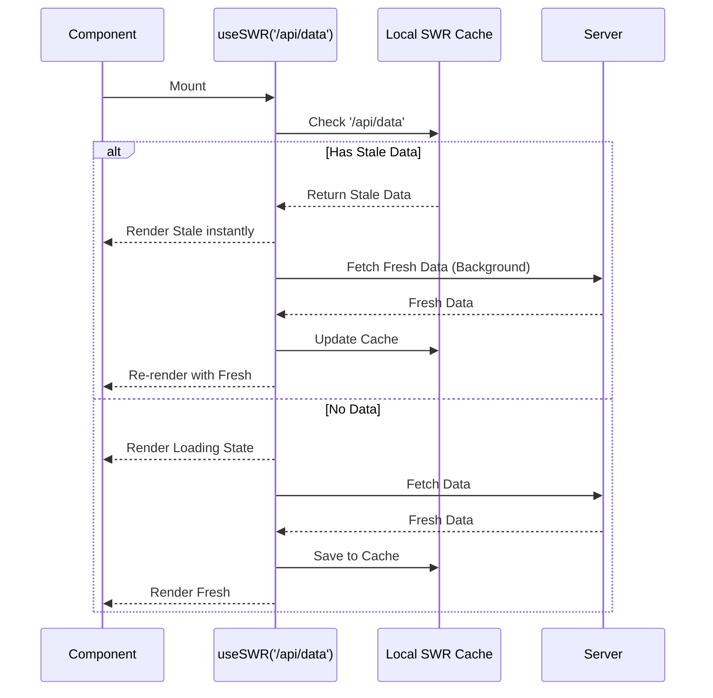

# SWR

## Инженерная история: Stale-While-Revalidate

Запрос данных с сервера — это не просто `fetch`. Это управление состояниями загрузки, обработка ошибок, кэширование, дедупликация запросов (чтобы два компонента не запрашивали одно и то же) и инвалидация. Решать это с помощью Redux + Thunk было долго и больно. 

Команда Vercel (создатели Next.js) выпустила **SWR** (название происходит от HTTP cache-control директивы `stale-while-revalidate`). Философия проста: интерфейс должен быть быстрым всегда. Когда компонент монтируется, SWR сначала мгновенно отдает "протухшие" (stale) данные из локального кэша, параллельно отправляет фоновый запрос (revalidate) за свежими данными, и как только они приходят — обновляет UI.

## Как это работает на практике

Вы передаете хуку ключ (обычно это URL) и функцию-fetcher. SWR берет на себя всю грязную работу. Если пользователь переключается на другую вкладку браузера и возвращается — SWR автоматически перезапрашивает данные (focus revalidation), чтобы интерфейс всегда был актуальным.



## Примеры кода

### ❌ Антипаттерн: Ручной `useEffect` для запросов

Много кода, нет кэширования, нет дедупликации, нет авто-обновления.

```javascript
function Profile() {
  const [data, setData] = useState(null);
  const [isLoading, setLoading] = useState(true);

  useEffect(() => {
    fetch('/api/user').then(res => res.json()).then(d => {
      setData(d); setLoading(false);
    });
  }, []);

  if (isLoading) return <Spinner />;
  return <div>{data.name}</div>;
}
```

### ✅ Правильное решение: Магия useSWR

Лаконично, быстро и с глобальным кэшем "из коробки".

```javascript
import useSWR from 'swr';

// Fetcher - это просто обертка над вашим любимым клиентом (fetch, axios, graphql)
const fetcher = url => fetch(url).then(res => res.json());

function Profile() {
  const { data, error, isLoading } = useSWR('/api/user', fetcher);

  if (error) return <div>Failed to load</div>;
  if (isLoading) return <Spinner />;
  // data уже содержит кэшированные или свежие данные
  return <div>{data.name}</div>;
}
```

## Неочевидные нюансы и границы применимости

- **Конкурент TanStack Query:** SWR легче и проще в освоении, чем TanStack Query (React Query), но у него слабее развит инструментарий для сложных мутаций (POST/PUT/DELETE запросов) и ручной инвалидации графа кэшей.
- **Глобальная конфигурация:** Если не настроить `SWRConfig` на уровне приложения (с единым fetcher'ом), придется прокидывать fetcher в каждый хук.
- **Агрессивный ререндеринг:** Фоновая ревалидация при фокусе окна (revalidateOnFocus) — это круто, но если ваш API медленный или платный, пользователи будут "сжигать" квоту просто переключаясь между вкладками. Эту фичу часто отключают.
- **Сфера применения:** Идеально подходит для средних проектов, информационных панелей, лендингов с динамикой и проектов на Next.js, где не требуется сверхсложное управление оптимистичными обновлениями.
