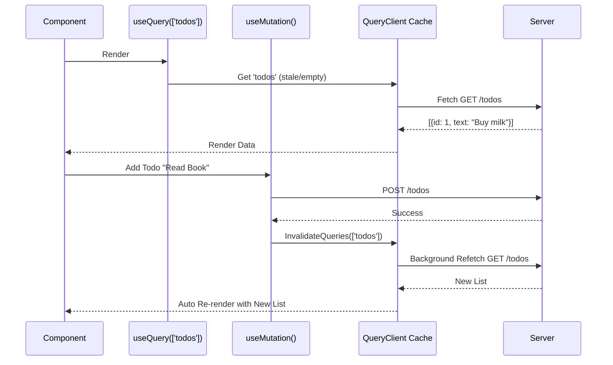

# TanStack Query (React Query)

## Инженерная история: Король серверного состояния

Долгое время фронтендеры относились ко всем данным одинаково: клали их в Redux или MobX. Но со временем пришло осознание: данные с сервера (Server State) кардинально отличаются от UI-состояния (Client State). Серверные данные нам не принадлежат, они могут устареть в любую секунду, их нужно кэшировать, дедуплицировать и инвалидировать.

TanStack Query (ранее React Query) совершил революцию, предложив абстракцию не над сетью (как Axios), а над **асинхронным кэшем**. Он берет на себя всю тяжелую работу: кэширование, фоновую ревалидацию, оптимистичные обновления, пагинацию и бесконечные списки. Вы просто вызываете хук с массивом ключей (`queryKey`), и если по этому ключу уже есть свежие данные — они возвращаются мгновенно.

## Как это работает на практике

Архитектура строится вокруг `QueryClient` (глобального кэша). Каждый запрос идентифицируется массивом ключей (например, `['users', userId]`). При выполнении мутации вы говорите кэшу: "инвалидируй все запросы, чей ключ начинается с 'users'".



## Примеры кода

### ❌ Антипаттерн: Управление серверным состоянием на клиенте

Синхронизация данных вручную через Redux или Context ведет к багам.

```javascript
// Нужно самому управлять isLoading, error, и как-то чистить стейт
const dispatch = useDispatch();
useEffect(() => {
  dispatch(fetchTodos());
}, []);

const submit = async (data) => {
  await api.postTodo(data);
  dispatch(fetchTodos()); // Ручной рефетч
};
```

### ✅ Правильное решение: TanStack Query

Кэш обновляется сам, UI реагирует на кэш.

```javascript
import { useQuery, useMutation, useQueryClient } from '@tanstack/react-query';

function TodoList() {
  const queryClient = useQueryClient();
  
  // Чтение данных
  const { data, isLoading } = useQuery({
    queryKey: ['todos'],
    queryFn: () => fetch('/todos').then(res => res.json())
  });

  // Мутация
  const mutation = useMutation({
    mutationFn: newTodo => fetch('/todos', { method: 'POST', body: newTodo }),
    onSuccess: () => {
      // Магия тут: инвалидируем ключ, и useQuery сам перезапросит данные
      queryClient.invalidateQueries({ queryKey: ['todos'] });
    }
  });

  if (isLoading) return <Spinner />;
  return (
    <div>
      {data.map(todo => <div key={todo.id}>{todo.text}</div>)}
      <button onClick={() => mutation.mutate({ text: 'New' })}>Add</button>
    </div>
  );
}
```

## Неочевидные нюансы и границы применимости

- **Stale vs Inactive:** Новички часто путают два таймаута: `staleTime` (время, пока данные считаются свежими, по умолчанию 0 — данные устаревают моментально) и `gcTime` / `cacheTime` (время, через которое данные удаляются из памяти, если на них нет ни одного подписчика в UI).
- **Сложность Query Keys:** В крупном приложении ключи запросов превращаются в ад. Нужно создавать фабрики ключей (Query Key Factories), чтобы случайно не ошибиться в написании ключа при инвалидации `['todos', 'list', 'active']`.
- **Замена Redux:** В 90% современных проектов связка TanStack Query (для сервера) + Zustand (для UI стейта) полностью вытеснила огромные сборки на Redux Toolkit.
- **Оптимистичные обновления:** Реализовать их легко, но писать код возврата к предыдущему состоянию при ошибке (rollback) бывает весьма многословно.
