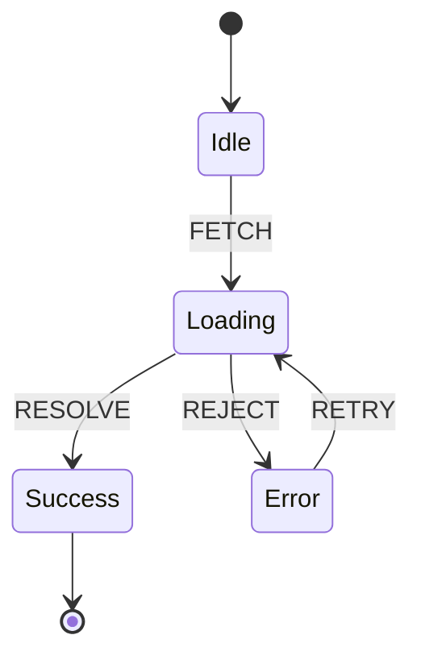

# XState

## Инженерная история: Конечные автоматы на клиенте

Сколько раз вы видели в коде что-то вроде: `if (isLoading && !isError && data)`? Управление сложным состоянием с помощью множества булевых флагов быстро приводит к "невозможным состояниям" (impossible states). Например, когда `isLoading: true` и `isError: true` одновременно. Как такое отображать? 

XState решает эту проблему через строгую математическую концепцию — **Конечные Автоматы (Finite State Machines, FSM)** и **Statecharts** (диаграммы состояний). В автомате система всегда находится ровно в *одном* из конечных состояний (например, "idle", "loading", "success", "error"). Переход между состояниями возможен только через явно определенные события. Невозможно перейти из "error" в "success", не пройдя через "loading".

## Как это работает на практике

Вы описываете всю логику как JSON-объект конфигурации машины. Автомат реагирует на события (events), вызывает побочные эффекты (actions), запускает асинхронные задачи (services) и хранит дополнительные данные контекста (context).



## Примеры кода

### ❌ Антипаттерн: Суп из булевых флагов

Легко допустить ошибку и оказаться в непредсказуемом состоянии.

```javascript
function VideoPlayer() {
  const [isPlaying, setIsPlaying] = useState(false);
  const [isBuffering, setIsBuffering] = useState(false);
  const [hasError, setHasError] = useState(false);

  const play = () => {
    // А если hasError? А если isBuffering? Нужно всё проверять.
    setIsPlaying(true);
  };
}
```

### ✅ Правильное решение: Машина состояний XState

Машина строго регламентирует, какие события доступны в текущем состоянии.

```javascript
import { createMachine } from 'xstate';
import { useMachine } from '@xstate/react';

// 1. Описание автомата
const fetchMachine = createMachine({
  id: 'fetch',
  initial: 'idle',
  states: {
    idle: {
      on: { FETCH: 'loading' } // Из idle можно только в loading
    },
    loading: {
      on: {
        RESOLVE: 'success',
        REJECT: 'error'
      }
    },
    success: {
      type: 'final' // Конечное состояние, выходов нет
    },
    error: {
      on: { RETRY: 'loading' }
    }
  }
});

// 2. Использование в UI
function DataComponent() {
  const [state, send] = useMachine(fetchMachine);

  // state.value содержит текущее состояние (строку 'idle', 'loading' и т.д.)
  if (state.matches('loading')) return <Spinner />;
  if (state.matches('error')) return <button onClick={() => send({ type: 'RETRY' })}>Retry</button>;
  
  return <button onClick={() => send({ type: 'FETCH' })}>Load Data</button>;
}
```

## Неочевидные нюансы и границы применимости

- **Огромный порог входа:** Написание стейтчартов требует изменения мышления. Код машины получается весьма объемным и вербозным.
- **Визуализатор:** Главная суперсила XState — это возможность скопировать код вашей машины, вставить его в [XState Visualizer](https://stately.ai/viz) и увидеть интерактивный граф. Это потрясающе работает как живая документация для бизнеса и QA.
- **Интеграция:** XState полностью независим от фреймворка, логику можно перенести из React в Vue или даже на бэкенд (Node.js).
- **Сфера применения:** Это оверхед для простых формочек. Но для сложных, многошаговых процессов (визард оплаты, корзина покупок, медиаплеер, сложные формы авторизации, IoT-интерфейсы) XState — это абсолютный спаситель, который гарантирует, что вы никогда не окажетесь в баганутом состоянии.
