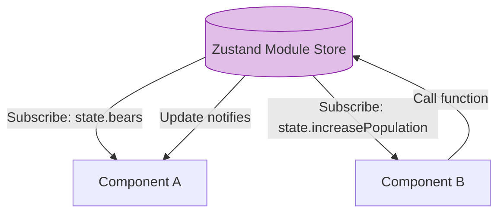

# Zustand

## Инженерная история: Минимализм, который победил

На протяжении многих лет разработчики искали замену перегруженному бойлерплейтом Redux. Появлялись новые решения (Recoil, MobX), но они приносили с собой сложные концепции: атомы, прокси-объекты, направленные графы.

Zustand (по-немецки "состояние") появился как глоток свежего воздуха. Это невероятно маленькая, быстрая и масштабируемая библиотека, которая взяла лучшую идею Redux — единый стор (Single Source of Truth) — и выкинула всё остальное (редюсеры, экшены, диспетчеры, провайдеры контекста). Вы просто создаете хук, который хранит состояние и функции для его изменения. Всё!

## Как это работает на практике

Zustand не использует React Context под капотом (он основан на замыканиях и модульном стейте). Это означает две вещи: 
1. Не нужно оборачивать приложение в `<Provider>`.
2. Компонент перерендеривается *только тогда*, когда изменяется та часть состояния, которую он явно достал (через селектор).



## Примеры кода

### ❌ Антипаттерн: Redux для простых задач

Создание экшенов, констант и редюсеров просто для изменения счетчика в глобальном состоянии.

```javascript
// Где-то в недрах Redux
const INCREMENT = 'INCREMENT';
export const increment = () => ({ type: INCREMENT });
// ...и еще 20 строк редюсера и store.js
```

### ✅ Правильное решение: Zustand Hook

Весь стор помещается в 5 строк кода, объединенных вместе: данные и логика рядом.

```javascript
import { create } from 'zustand';

// 1. Создаем стор-хук
const useStore = create((set) => ({
  bears: 0,
  increasePopulation: () => set((state) => ({ bears: state.bears + 1 })),
  removeAllBears: () => set({ bears: 0 }),
}));

// 2. Читаем данные
function BearCounter() {
  const bears = useStore((state) => state.bears);
  return <h1>{bears} around here ...</h1>;
}

// 3. Вызываем экшены
function Controls() {
  // Достаем функцию. Компонент НЕ будет перерендериваться при изменении bears!
  const increasePopulation = useStore((state) => state.increasePopulation);
  return <button onClick={increasePopulation}>one up</button>;
}
```

## Неочевидные нюансы и границы применимости

- **Модульный стейт и Тестирование:** Так как Zustand не использует Context, стор живет на уровне модуля (синглтон). В тестах, если вы не замокаете или не сбросите стор вручную, состояние перетечет из одного теста в другой.
- **Использование вне React:** Zustand позволяет обращаться к состоянию напрямую из ванильного JS, без хуков (`useStore.getState()`). Это идеально для работы внутри веб-сокетов, таймеров или роутера.
- **Организация кода:** Из-за невероятной свободы новички часто засовывают в один файл стора вообще всё (сотни функций и полей). Нужно использовать паттерн слайсов (slices), разбивая логику на части, чтобы не получить монолитного монстра.
- **Сфера применения:** Zustand стал стандартом де-факто для глобального UI-состояния (модалки, темы, сайдбары) в связке с TanStack Query (для серверного состояния). Идеален для любых проектов, от лендингов до энтерпрайза.
