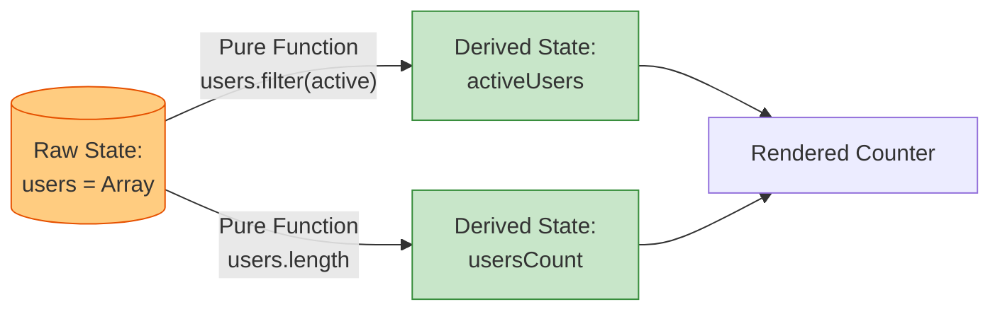

# Derived State (Производное состояние)

## Инженерная история: Единственный источник истины

Одна из самых частых причин багов в сложных интерфейсах — рассинхронизация состояний. Разработчик запрашивает список пользователей, сохраняет его в стейт, а затем отдельно сохраняет в другой стейт количество этих пользователей или отфильтрованный список. Когда исходный список обновляется, разработчик забывает обновить "счетчик", и интерфейс начинает лгать.

Концепция **Производного состояния (Derived State)** решает эту проблему радикально: *если значение можно вычислить на лету из существующих данных (props или state), его нельзя хранить в стейте*. Производное состояние — это чистая функция от источника истины, которая гарантирует 100% консистентность.

## Как это работает на практике

Вы храните только минимально необходимый "сырой" стейт. Во время каждого рендера компонента (или в геттерах стора) вы берете сырые данные и прогоняете через функции вычисления (фильтрацию, маппинг, агрегацию). Если вычисления тяжелые, применяется мемоизация (`useMemo` или селекторы).



## Примеры кода

### ❌ Антипаттерн: Дублирование стейта и рассинхронизация

Мы храним в стейте и сам массив, и отфильтрованную версию. Приходится использовать `useEffect` для синхронизации, что приводит к лишним рендерам и каскадным обновлениям.

```javascript
function UsersList({ initialUsers }) {
  const [users, setUsers] = useState(initialUsers);
  const [activeUsers, setActiveUsers] = useState([]);

  // Плохо: useEffect для вычисления стейта из другого стейта
  useEffect(() => {
    setActiveUsers(users.filter(u => u.isActive));
  }, [users]);

  // Плохо: при добавлении юзера мы сначала рендерим новый users, 
  // потом срабатывает эффект, и рендерится новый activeUsers.
}
```

### ✅ Правильное решение: Вычисление на лету

Удаляем лишний стейт. Данные вычисляются синхронно во время рендера.

```javascript
function UsersList({ initialUsers }) {
  const [users, setUsers] = useState(initialUsers);

  // Хорошо: вычисляем прямо в теле компонента
  const activeUsers = users.filter(u => u.isActive);
  
  // Опционально: если массив огромный, используем мемоизацию
  // const activeUsers = useMemo(() => users.filter(u => u.isActive), [users]);

  return (
    <div>
      Total: {users.length}, Active: {activeUsers.length}
      {/* ... */}
    </div>
  );
}
```

## Неочевидные нюансы и границы применимости

- **Преждевременная оптимизация:** Многие разработчики оборачивают *каждое* производное состояние в `useMemo`. Это ошибка. `useMemo` сам по себе имеет накладные расходы на замыкание и проверку зависимостей. Вычислить `items.filter()` для массива из 100 элементов занимает доли миллисекунды. Мемоизация нужна только для действительно тяжелых вычислений или сохранения ссылочной идентичности объектов (чтобы не триггерить дочерние `React.memo`).
- **Сложные графы:** Когда производное состояние вычисляется на основе другого производного состояния, цепочка может стать запутанной. В таких случаях помогают продвинутые селекторы с кэшированием, как `reselect` (в Redux) или `computed` (в MobX/Vue).
- **Инициализация:** "Вычисляй на лету" — это главное правило React. Единственное исключение, когда нужно копировать пропсы в стейт — это если вы создаете начальное состояние для *формы редактирования*, которое пользователь должен иметь возможность изменить (и где пропсы выступают просто как `initialData`).
