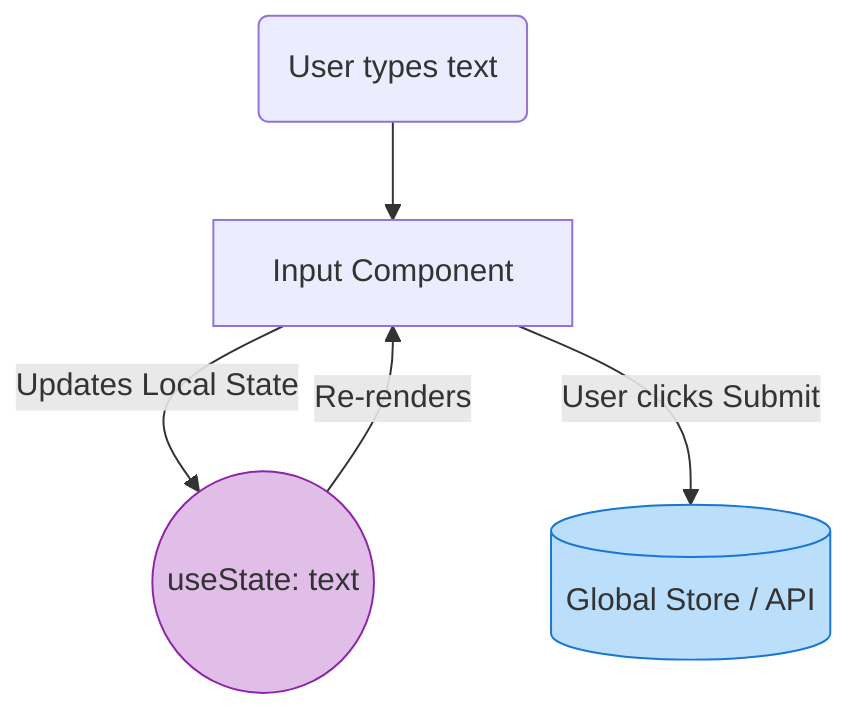

# Ephemeral State (Эфемерное состояние)

## Инженерная история: Быстротечное состояние UI

Когда фронтендеры впервые открыли для себя Redux, многие ударились в крайность: начали выносить абсолютно все данные в глобальный Store. Открыто ли модальное окно? Какой текст сейчас вбивается в инпут поиска? Наведена ли мышка на кнопку? Всё это летело в Redux. Результат был катастрофическим: при каждом нажатии клавиши глобальный стейт обновлялся, заставляя пересчитываться всё дерево компонентов, а Redux DevTools превращался в нечитаемую свалку из тысяч экшенов `UPDATE_INPUT_VALUE`.

Эфемерное (или локальное) состояние — это короткоживущие данные, которые нужны только одному конкретному компоненту (или небольшой ветви) прямо сейчас. Это состояние существует, пока компонент жив на экране, и безвозвратно исчезает (destroy), когда компонент размонтируется.

## Как это работает на практике

Эфемерное состояние всегда должно жить максимально близко к тому месту, где оно используется. Если данные нужны только для внутренней логики компонента и не влияют на бизнес-процессы остального приложения — это эфемерное состояние.



## Примеры кода

### ❌ Антипаттерн: Глобализация локального стейта

Хранение состояния инпута в Redux/Zustand ради "архитектурной чистоты".

```javascript
// Плохо: каждый символ вызывает глобальный action и перерендер
function SearchBar() {
  const query = useSelector(state => state.search.query);
  const dispatch = useDispatch();

  return (
    <input 
      value={query} 
      onChange={e => dispatch({ type: 'SET_QUERY', payload: e.target.value })} 
    />
  );
}
```

### ✅ Правильное решение: Локальный стейт + Глобальный сабмит

Стейт живет в `useState` и отправляется в "большой мир" только по факту завершения действия.

```javascript
function SearchBar({ onSearchSubmit }) {
  // Хорошо: эфемерное состояние, не трогает остальное приложение
  const [query, setQuery] = useState('');

  return (
    <div>
      <input 
        value={query} 
        onChange={e => setQuery(e.target.value)} 
      />
      <button onClick={() => onSearchSubmit(query)}>Search</button>
    </div>
  );
}
```

## Неочевидные нюансы и границы применимости

- **Потеря данных при размонтировании:** Главное свойство эфемерного стейта — оно сбрасывается. Если у вас сложная многошаговая форма (wizard), и пользователь переключается между вкладками, использование `useState` на каждой вкладке приведет к потере введенных данных. В этом случае стейт нужно "поднять" (Lift State Up) или сделать его глобальным/персистентным.
- **Поднятие состояния (Lifting State Up):** Если два соседних компонента должны знать об одном эфемерном стейте (например, аккордеон, где открытие одной панели закрывает другую), стейт нужно поднять в их общего родителя.
- **Границы применимости:** Идеально для состояния UI-элементов (анимации, фокус, ховер, статус загрузки локальной картинки, значения простых инпутов). Никогда не используйте глобальные сторы для этих задач.
