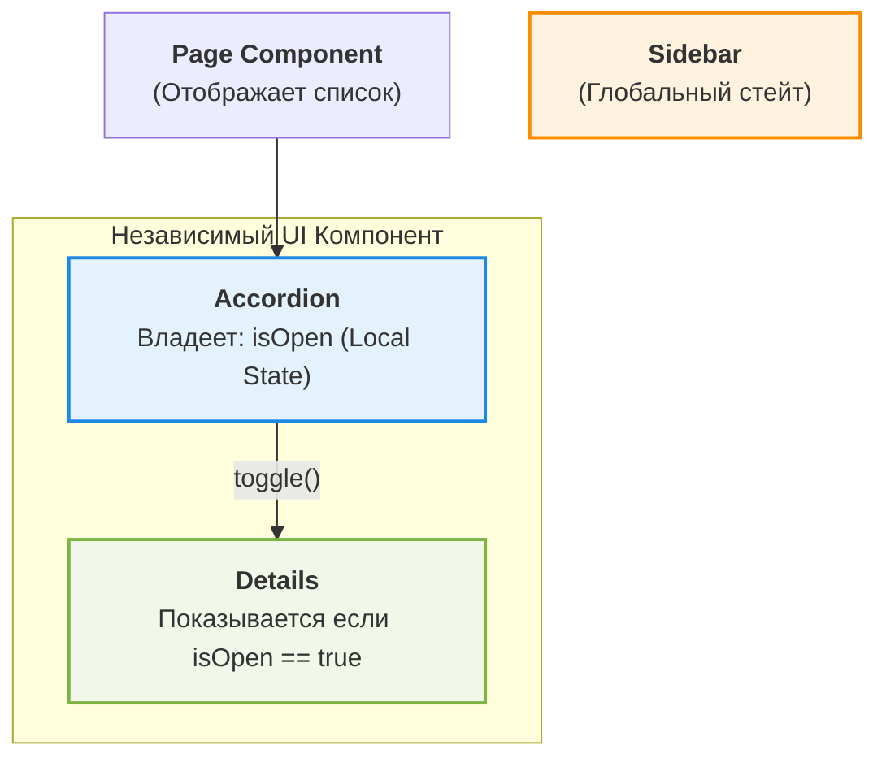

# Local UI State (Локальное состояние UI)

Local UI State — это состояние, которое существует и имеет смысл только в рамках одного компонента или небольшого дерева компонентов. Оно отвечает за интерактивность интерфейса: открыт ли дропдаун, какой таб выбран, введен ли текст в поле поиска (до отправки на сервер).

## Какую боль мы решаем?

Когда разработчики только знакомятся с глобальными стейт-менеджерами (Redux, MobX), возникает соблазн вынести **все** состояние приложения в глобальный стор. Это приводит к:
- **Раздуванию глобального стора (Bloated Store):** Стор заполняется мусором вроде `isModalOpen`, `activeTabIndex`, `dropdownHovered`.
- **Проблемам с производительностью:** Изменение буквы в поле ввода вызывает обновление всего глобального стора и ререндер не связанных компонентов (оверхед).
- **Сложности переиспользования:** Если компонент (например, модалка) привязан к конкретному флагу в Redux, вы не сможете отрендерить две такие модалки на одной странице без дублирования экшенов и редюсеров.

Локальное состояние инкапсулирует UI-логику там, где она реально нужна, делая компоненты независимыми (plug-and-play).

## Как это работает на практике

Локальное состояние живет внутри компонента и уничтожается (unmount), когда компонент уходит со страницы. 


*Здесь `isOpen` не нужно знать ни Sidebar, ни Page. Это чисто локальное дело аккордеона.*

### Пример: Изоляция состояния (Как надо)

```tsx
import { useState } from 'react';

// Компонент полностью самодостаточен
export function CollapsibleSection({ title, children }) {
  // Local UI State: существует только внутри этого экземпляра компонента
  const [isOpen, setIsOpen] = useState(false);

  return (
    <div className="border rounded">
      <button 
        onClick={() => setIsOpen(!isOpen)}
        className="font-bold p-2 w-full text-left"
      >
        {title} {isOpen ? '▼' : '▶'}
      </button>
      
      {isOpen && <div className="p-2">{children}</div>}
    </div>
  );
}
```
*Если мы отрендерим 10 таких компонентов, у каждого будет свой независимый `isOpen` стейт.*

## Неочевидные нюансы и трейдоффы

### Границы применимости
* **Идеально для:** Вкладок (tabs), аккордеонов, модальных окон, временного состояния форм (пока пользователь не нажал "Сохранить"), hover/focus эффектов (если они сложнее обычного CSS).
* **Не подходит для:** Данных профиля пользователя, содержимого корзины, токенов авторизации — всего того, к чему нужно обращаться с разных, не связанных экранов или маршрутов (тут нужен Global или Server State).

### Скрытые трейдоффы и где это ломается
1. **Потеря состояния при Unmount (Ephemeral Nature):** 
   Так как локальное состояние привязано к жизненному циклу компонента, при переходе на другую страницу и возврате обратно аккордеон снова закроется. Если бизнес-требование гласит: "Пользователь должен вернуться и увидеть открытый аккордеон", локальное состояние больше не подходит — его нужно поднимать в URL State или Global/Persisted State.
2. **Проп-дриллинг:** 
   Если локальное состояние нужно передать на 5 уровней вложенности вниз, это начинает усложнять код. В таких случаях стоит рассмотреть использование локального Context API или композиции компонентов (передача через `children`), а не делать стейт глобальным.
3. **Сложные формы:**
   В больших динамических формах чисто локальный стейт (`useState` на каждое поле) может сильно тормозить рендер. В этом случае применяются специализированные библиотеки (React Hook Form), которые управляют локальным стейтом формы через uncontrolled components (рефы) для обхода частых ререндеров.