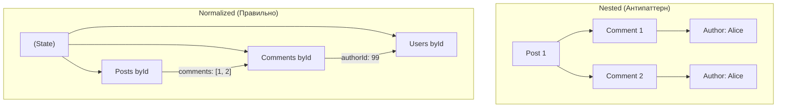

# Normalized State (Нормализованное состояние)

## Инженерная история: Базы данных на клиенте

Представьте, что вы загрузили с сервера пост в блоге. Пост содержит массив комментариев. Каждый комментарий содержит объект автора. Итоговый JSON — это глубокое дерево. 
Теперь пользователь меняет свою аватарку в настройках. Чтобы обновить её в UI, вам придется написать код, который пробежит по всем постам, внутри них — по всем комментариям, найдет нужного автора и обновит ссылку на картинку. Это медленно, сложно читаемо и ведет к багам (например, вы обновили автора в комментариях, но забыли обновить в списке лайков).

Нормализация решает эту боль, перенося концепции реляционных баз данных на фронтенд. Вместо глубоких деревьев мы храним данные "плоско", в виде словарей (хэш-таблиц), где ключом выступает ID сущности. А связи между объектами задаются массивами ID.

## Как это работает на практике

Данные хранятся в таблицах `byId` (для быстрого доступа) и `allIds` (для сохранения порядка). Изменение сущности происходит только в одном месте (Словарная таблица), и все компоненты, подписанные на этот ID, моментально получают обновленные данные.



## Примеры кода

### ❌ Антипаттерн: Глубокая вложенность

Мутация глубокого дерева превращается в ад иммутабельности.

```javascript
const state = {
  posts: [
    {
      id: 1, title: 'Hello',
      comments: [
        { id: 10, text: 'Nice!', author: { id: 99, name: 'Alice' } }
      ]
    }
  ]
};

// Чтобы изменить имя Alice:
const newState = {
  ...state,
  posts: state.posts.map(post => ({
    ...post,
    comments: post.comments.map(c => 
      c.author.id === 99 ? { ...c, author: { ...c.author, name: 'Alicia' } } : c
    )
  }))
};
```

### ✅ Правильное решение: Плоские словари

Обновление происходит за О(1) и предельно просто.

```javascript
// Структура нормализована
const state = {
  posts: { 1: { id: 1, title: 'Hello', comments: [10] } },
  comments: { 10: { id: 10, text: 'Nice!', authorId: 99 } },
  users: { 99: { id: 99, name: 'Alice' } }
};

// Обновление имени:
const newState = {
  ...state,
  users: {
    ...state.users,
    99: { ...state.users["99"], name: 'Alicia' }
  }
};
// Post и Comment вообще не нужно трогать!
```

## Неочевидные нюансы и границы применимости

- **Сложность чтения (Select):** Писать данные в нормализованный стейт легко, но вот читать их сложно. Чтобы отрендерить пост, вам нужно написать селектор, который "сджойнит" (Join) пост, комментарии и пользователей обратно в иерархическое дерево для UI.
- **Инструментарий:** Нормализацию редко пишут руками. Для ванильного Redux раньше использовали `normalizr`. Сейчас в Redux Toolkit есть `createEntityAdapter`, который автоматизирует создание `byId` и `allIds`.
- **Конкуренты:** Современные библиотеки (Apollo Client для GraphQL, Relay) нормализуют данные под капотом абсолютно прозрачно для разработчика. TanStack Query (React Query) *не* нормализует данные, опираясь на инвалидацию целых запросов.
- **Границы применимости:** Нормализация необходима только в сложных приложениях с высокой степенью интерактивности, где одни и те же сущности (пользователи, задачи, теги) встречаются на разных экранах и часто мутируются (например, Jira, Twitter, Trello). Для простых CRUD-интерфейсов это избыточный оверхед.
