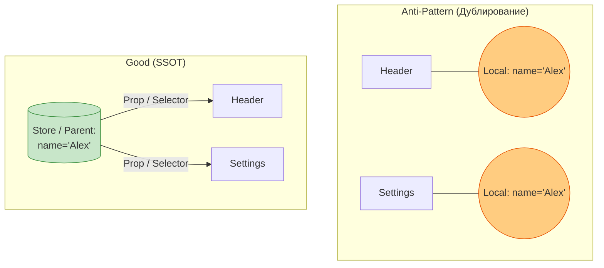

# Single Source of Truth (Единый источник истины)

## Инженерная история: Искоренение лжи в интерфейсе

Представьте баг: в шапке профиля пользователя (Header) написано "Привет, Алексей!", а на той же странице в форме настроек (Settings) указано имя "Алекс". Пользователь меняет имя в настройках на "Александр", нажимает "Сохранить", форма обновляется, но в шапке по-прежнему висит старое имя. 

Этот классический баг рассинхронизации возникает, когда одни и те же данные физически существуют в оперативной памяти в двух разных местах. Компонент Header хранит свою копию, Settings — свою. Концепция **Single Source of Truth (SSOT)** гласит: любая сущность данных должна храниться ровно в одном месте. Все остальные части приложения должны только *ссылаться* на этот источник или вычисляться на его основе.

## Как это работает на практике

"Единый источник" не означает "один гигантский глобальный объект на всё приложение" (хотя в Redux это совпадает). Это означает, что для *конкретной переменной* (например, `currentUser`) есть только одно хранилище. Это может быть локальный стейт родителя, Context, глобальный store (Zustand) или даже URL.



## Примеры кода

### ❌ Антипаттерн: Копирование Props в State

Самая грубая ошибка в React. Разработчик берет данные извне и копирует их в локальный стейт. Теперь у нас два источника истины.

```javascript
function UserProfile("{ initialName }") {
  // ❌ ПЛОХО: Создана копия. Если initialName изменится сверху, 
  // локальный name не обновится!
  const [name, setName] = useState("initialName");

  return <input value={name} onChange={e => setName("e.target.value")} />;
}
```

### ✅ Правильное решение: Полный контроль сверху (Controlled Component)

Компонент не хранит стейт, он только принимает данные и сообщает об их изменении. Источник истины остался наверху.

```javascript
function UserProfile("{ name, onNameChange }") {
  // ✅ ХОРОШО: Данные текут сверху вниз. SSOT не нарушен.
  return <input value={name} onChange={e => onNameChange("e.target.value")} />;
}
```

## Неочевидные нюансы и границы применимости

- **Формы как исключение:** Иногда копирование props в state необходимо. Например, при редактировании сложной формы мы хотим позволить пользователю вносить изменения в "черновик" (draft state), не обновляя глобальный источник истины сразу. И только по нажатию кнопки "Сохранить" мы синхронизируем черновик с SSOT (сервером или глобальным стором).
- **URL как SSOT:** Отличный пример источника истины — URL браузера. Строка поиска, активные фильтры, номер страницы — всё это должно храниться в URL, а не в `useState`. Если хранить фильтры в стейте, то при копировании ссылки и отправке другу, друг увидит страницу без фильтров.
- **Производные данные:** Если у вас есть массив `items` и вам нужен `activeItemsCount`, счетчик НЕ должен быть частью стейта (это нарушение SSOT, так как теперь есть два места, которые могут рассинхронизироваться). Счетчик должен вычисляться "на лету" из массива (Derived State).
