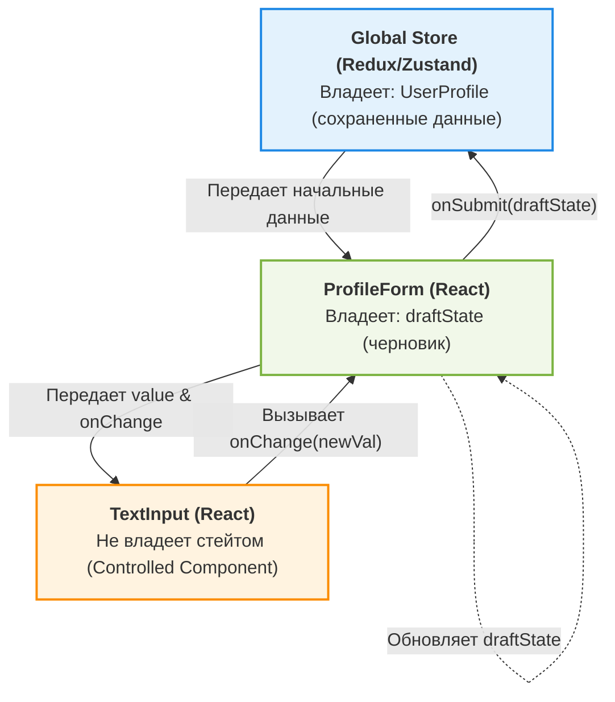

# State Ownership (Владение состоянием)

State Ownership — это концепция, определяющая, какой компонент, модуль или слой архитектуры является единоличным "хозяином" (владельцем) определенной части состояния (state) приложения. Хозяин несет ответственность за хранение, обновление и распространение этого состояния.

## Какую боль мы решаем?

В сложных Frontend-приложениях состояние часто размазывается по множеству компонентов. Без четкого понимания "кто владеет данными" возникают следующие проблемы:
- **Рассинхронизация данных:** Один компонент обновил данные локально, а другой все еще показывает старые.
- **Проп-дриллинг (Prop Drilling):** Передача коллбеков изменения состояния через десяток промежуточных компонентов, что усложняет рефакторинг.
- **Непредсказуемые сайд-эффекты:** Непонятно, кто именно и в какой момент изменил стейт, что превращает дебаггинг в кошмар (особенно при race conditions).

State Ownership вводит строгое правило: изменять состояние может **только его владелец**. Остальные могут лишь читать его или посылать запросы на изменение (через коллбеки или экшены).

## Как это работает на практике

Представим форму редактирования профиля. Кто владеет состоянием полей формы? Глобальный стор? Сама форма? Поле ввода? 
Правильный подход — состояние формы принадлежит компоненту формы (или локальному стейт-менеджеру формы), а глобальный стор (например, Redux) получает только итоговый результат при сабмите.



### Пример: Controlled Components (Как надо)
В React паттерн Controlled Component является классической реализацией State Ownership. Владелец стейта — родитель.
```tsx
// Владелец состояния (Parent)
function UserProfile() {
  const [username, setUsername] = useState("john_doe");

  // Только владелец имеет право менять состояние
  const handleUsernameChange = (newUsername: string) => {
    setUsername(newUsername);
  };

  return <TextInput value={username} onChange={handleUsernameChange} />;
}

// Потребитель состояния (Child) - "глупый" компонент
function TextInput({ value, onChange }: { value: string; onChange: (val: string) => void }) {
  // Антипаттерн: создавать здесь дублирующий стейт `const [val, setVal] = useState(value)`
  return <input value={value} onChange={(e) => onChange(e.target.value)} />;
}
```

## Неочевидные нюансы и трейдоффы

### Границы применимости
* **Глобальный vs Локальный стейт:** Если данными (например, темой оформления) пользуется всё приложение, владельцем должен быть глобальный стор или контекст на самом верхнем уровне. Если это состояние открытого дропдауна — владельцем должен быть сам компонент дропдауна.
* **Серверное состояние:** Важно понимать, что клиент *не владеет* данными базы данных. Клиент лишь кэширует их. Истинный владелец — сервер. Инструменты вроде React Query помогают управлять этим кэшем, абстрагируя логику синхронизации.

### Где это ломается (Антипаттерны)
1. **Разделенное владение (Split Ownership):** Когда два независимых компонента пытаются управлять одной и той же сущностью (например, и родитель, и ребенок хранят у себя независимый стейт `isOpen`). Это приводит к конфликтам и рассинхрону.
2. **Слишком высокое поднятие состояния (State Hoisting):** Поднятие локального состояния формы ввода в глобальный стор (Redux). Это вызывает лишние ререндеры всего дерева при каждом нажатии клавиши и засоряет историю экшенов (оверхед).
3. **Derived State как отдельный стейт:** Если значение можно вычислить из существующих пропсов или стейта (например, `fullName` из `firstName` и `lastName`), не нужно создавать для него отдельный стейт. Вычисляйте его на лету в render-фазе. Создание отдельного стейта нарушает принцип Single Source of Truth.
