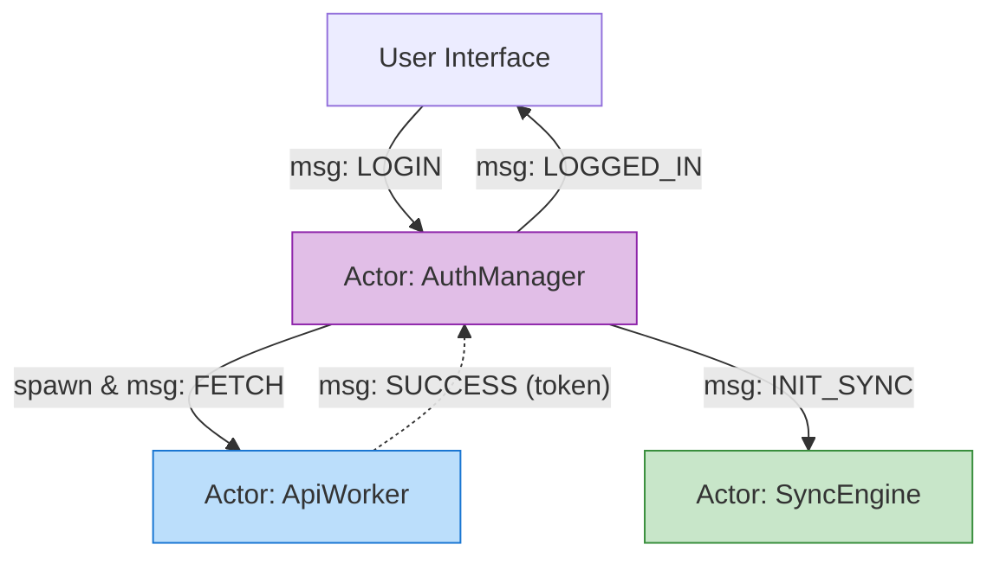

# Actor Model (Модель Акторов)

## Инженерная история: Асинхронные микросервисы в памяти

Когда интерфейс становится по-настоящему сложным (например, Google Docs, Figma или система видеонаблюдения), вызова обычных функций и обновления централизованного стейта становится недостаточно. Возникают проблемы конкурентности: несколько процессов пытаются изменить одни и те же данные одновременно.

Модель Акторов (Actor Model) — это концепция конкурентных вычислений, пришедшая из языков вроде Erlang/Elixir, но нашедшая применение и на фронтенде (например, в XState). В этой модели всё является "Актором". Актор — это независимая сущность, у которой есть собственное приватное состояние. **Единственный способ** взаимодействовать с актором — послать ему асинхронное сообщение. 

Получив сообщение, актор может:
1. Изменить свое локальное состояние.
2. Послать сообщения другим акторам.
3. Породить (spawn) новых акторов.

## Как это работает на практике

Представьте канвас с сотнями фигур. Каждая фигура — это актор. Они не знают о глобальном стейте приложения. Когда мышка кликает на фигуру, канвас шлет сообщение `CLICK` актору-фигуре. Фигура сама решает, как реагировать: изменить свой цвет и послать сообщение `PLAY_SOUND` актору-аудиопроигрывателю.



## Примеры кода

### ❌ Антипаттерн: Прямые вызовы и шаринг стейта

Компоненты жестко связаны, дергают методы друг друга напрямую, что ведет к гонкам состояний (race conditions) при асинхронности.

```javascript
// Плохо: Прямой вызов, блокировка, общее состояние
class AuthManager {
  async login("user, pass") {
    globalState.isLoading = true; // Шаринг стейта
    const data = await api.fetch("user, pass"); // Прямой вызов
    globalState.token = data.token;
  }
}
```

### ✅ Правильное решение: Передача сообщений (Message Passing)

Актор полностью изолирован. Внешний мир может только слать ему ивенты. (Пример концептуальный, на базе XState `spawn`).

```javascript
import { createMachine, spawn, sendParent } from 'xstate';

// Актор задачи (дочерний)
const taskMachine = createMachine({
  id: 'task',
  initial: 'idle',
  states: {
    idle: { on: { START: 'running' } },
    running: {
      invoke: {
        src: doHeavyWork,
        onDone: { target: 'done', actions: sendParent("'TASK_DONE'") }
      }
    },
    done: { type: 'final' }
  }
});

// Актор менеджер (родитель)
const managerMachine = createMachine({
  // ...
  on: {
    NEW_TASK: {
      actions: (context) => {
        // Порождаем нового независимого актора!
        const newTaskActor = spawn("taskMachine");
        context.tasks.push("newTaskActor");
      }
    }
  }
});
```

## Неочевидные нюансы и границы применимости

- **Сложность отладки (Дебаггинг):** Поскольку всё взаимодействие происходит через асинхронные сообщения, понять, "кто, кого и почему вызвал", становится сложно (отсутствует привычный Stack Trace вызовов функций). Требуются визуальные графы логов.
- **Оверхед на сообщения:** Для изменения одного пикселя слать JSON-сообщение через диспетчер — это излишняя работа процессора.
- **Изоляция:** Актор физически не может "залезть" в стейт другого актора. Это гарантирует отсутствие багов с мутациями, но заставляет писать много бойлерплейта для синхронизации данных между акторами (один отправляет `UPDATE`, другой его ловит).
- **Границы применимости:** Модель акторов блистает в системах с высокой степенью параллелизма и сложными фоновыми процессами (например, IoT-дашборды, игры на WebGL, сложные медиаредакторы). Для стандартного веб-приложения (магазин, блог) это абсолютный overkill.
