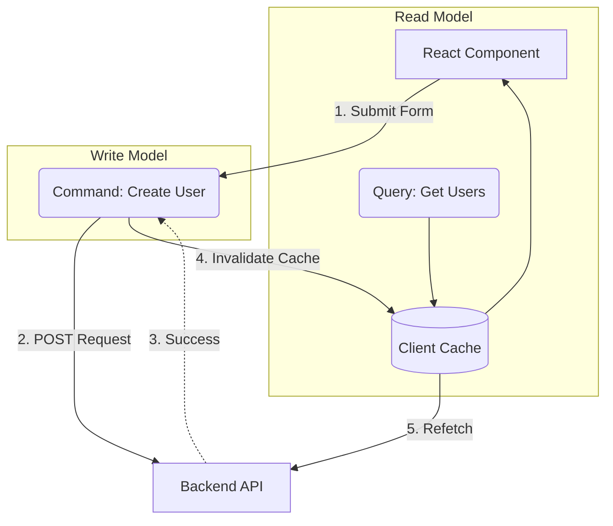

# CQRS для Frontend

## Инженерная история: Разделение чтения и записи

CQRS (Command Query Responsibility Segregation) — это классический бэкенд-паттерн, который гласит: методы, которые изменяют состояние (Commands), не должны возвращать данные; а методы, которые возвращают данные (Queries), не должны изменять состояние. 

На фронтенде мы исторически смешивали это в "суп": функция отправляла POST-запрос, получала обновленный объект в ответе, тут же обновляла глобальный Redux-стор, а заодно меняла локальный `isLoading`. Это приводило к невероятно хрупкому коду.
Применение CQRS на клиенте означает строгое разделение логики. Мы разделяем чтение (кэширование, пагинация, фильтры) и запись (отправка форм, мутации, оптимистичные обновления). Это решает проблему "God-объектов" в стейт-менеджерах.

## Как это работает на практике

Сегодня CQRS на фронтенде реализован "из коробки" в таких инструментах, как TanStack Query (React Query) или RTK Query. У вас есть явные `useQuery` (Чтение) и `useMutation` (Запись). Команда (Запись) только сообщает об успехе, что триггерит инвалидацию Квери (Чтение), заставляя его обновить данные.



## Примеры кода

### ❌ Антипаттерн: Смешивание логики (CRUD Суп)

Функция делает всё и сразу: отправляет данные, читает ответ, мутирует стейт.

```javascript
async function saveAndReloadUser(user) {
  setLoading(true);
  try {
    // Command
    const response = await api.post('/users', user);
    // Сразу же Query логика
    setLocalUsers(prev => [...prev, response.data]);
  } finally {
    setLoading(false);
  }
}
```

### ✅ Правильное решение: Strict CQRS (React Query)

Разделение обязанностей. Мутация только пишет и инвалидирует. Квери только читает.

```javascript
// Query (Чтение)
const { data: users } = useQuery(['users'], fetchUsers);

// Command (Запись)
const mutation = useMutation(createUser, {
  onSuccess: () => {
    // Мутация не трогает стейт пользователей напрямую!
    // Она просто говорит Query: "твои данные устарели"
    queryClient.invalidateQueries(['users']);
  }
});

// В UI: mutation.mutate(newUser);
```

## Неочевидные нюансы и границы применимости

- **Оверхед на инвалидацию:** При строгом CQRS после создания записи вы делаете второй сетевой запрос (GET), чтобы обновить список. Это может быть медленно на мобильном интернете.
- **Оптимистичные обновления:** Чтобы решить проблему медленного обновления, в CQRS внедряют Optimistic Updates (команда временно "обманывает" кэш чтения до ответа сервера), что сильно усложняет код отката (rollback) при ошибках.
- **Границы применимости:** CQRS прекрасен для сложных приложений (админки, социальные сети), где данные могут изменяться из множества разных мест. Для простейших форм (отправил контактную форму -> показал "Спасибо") это архитектурное излишество.
